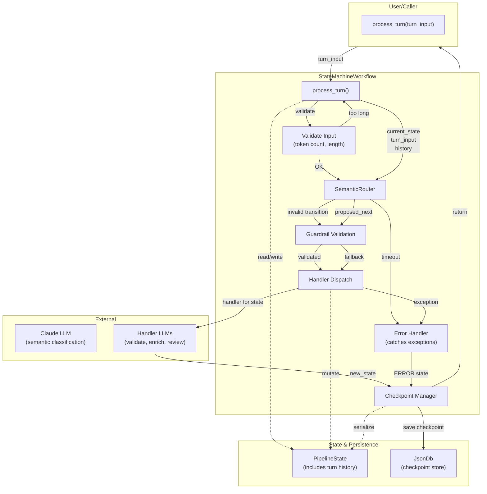
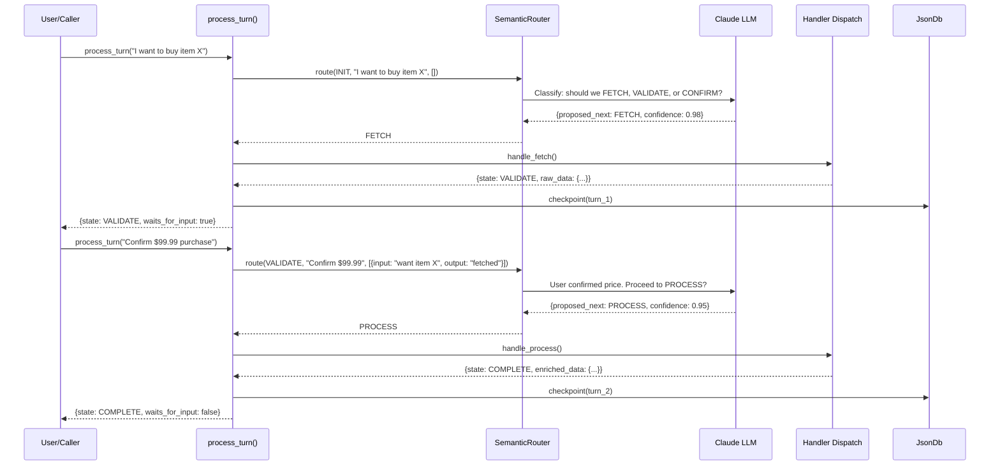
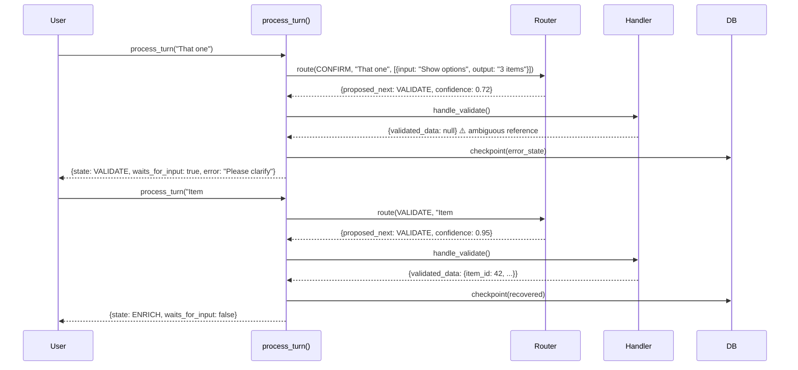

# Software Design Document: Multi-Turn Conversation Workflows
_Date: 2026-06-20_

---

## Section 1 — Introduction & Purpose

### 1.1 Background

The state machine workflow system was originally designed for **one-turn, single-document processing**: receive input → execute loop until terminal state → return result. This model works well for batch document processing (fetch → validate → enrich → store).

However, production use cases require **multi-turn conversations**: user provides input → system responds → user refines → system responds. Examples: order confirmation flow, data correction dialogue, human-in-the-loop review.

The multi-turn system extends the existing architecture **without breaking one-turn workflows**, enabling interactive, request/response interactions while preserving the state machine, guardrail, and audit trail infrastructure.

### 1.2 Scope

**In Scope:**
- Turn-based execution model (`process_turn(turn_input)` entry point)
- LLM-powered semantic router for next-state classification
- Per-turn checkpointing for resume capability
- Step metadata to distinguish immediate-execution vs. wait-for-input steps
- Conversation history context (last N turns) for router
- Full backward compatibility with one-turn workflows
- Type-safe state enums, TypedDict for state shape
- Input validation (length, token limits)
- Error recovery (handler exceptions → ERROR state)
- Configurable turn history window

### 1.3 Out of Scope

This design does **not** cover:
- Multi-document concurrent processing (session-scoped one-at-a-time)
- Escalation to human review within multi-turn (one-turn system has this; multi-turn inherits it)
- Custom prompt engineering per router (router uses single shared prompt template with turn history context)
- Prompt caching optimization (future performance tuning)
- History summarization algorithm (future for long conversations)
- Semantic entity extraction service (handled by LLM router only)
- Security sanitization beyond input validation (flagged as needs implementation)
- Distributed execution or async handlers

---

## Section 2 — System Architecture

### 2.1 High-Level Architecture



**Execution Flow:**
1. Caller invokes `process_turn(turn_input)` with user's text
2. Input validation: check length and token count
3. `SemanticRouter` reads current state + turn history → asks LLM for next state
4. `Guardrail` validates proposed transition (can override if invalid); on invalid, retry router with constraints
5. `Handler` executes (calls LLMs for validate/enrich/review, pure functions); exceptions caught and routed to ERROR
6. `CheckpointManager` saves state to JsonDb (including error states)
7. Returns checkpoint state (includes `waits_for_input` flag)
8. Caller decides: if waiting, prompt user for next turn; else auto-continue

### 2.2 Components

| Component | Responsibility | Key Methods |
|-----------|---|---|
| **SemanticRouter** | LLM-powered state classifier | `route(current_state, turn_input, history, timeout_sec=10) → {proposed_next, confidence, semantic_entities, semantic_intents}` |
| **process_turn()** | Single-turn executor | Entry point; validates input, calls router, guardrail, handler, checkpoint in sequence; catches handler exceptions |
| **@handler decorator** | Step metadata binding | Registers `state: State`, `waits_for_input: bool` per handler function |
| **PipelineState** | Extended state dict | Includes `turn_input`, `turns: list`, `turn_number`, `semantic_context`, error tracking |
| **CheckpointManager** | Persistence layer | Saves/loads state after each turn; trims history to last max_history_turns |
| **Guardrail** | Validation override | Inherited from one-turn; validates proposed transitions; retries router if invalid |

### 2.3 Architecture Principles

- **Backward Compatible:** One-turn workflows ignore `turn_input` and `turns` fields; continue using `process(doc_id)`
- **Single Responsibility:** Router handles routing only; handlers handle business logic only; guardrails validate only
- **Testability:** SemanticRouter is mockable; handlers remain pure functions; error paths are deterministic
- **Determinism with Audit Trail:** Every turn is logged; full conversation history persists to disk
- **Latency Budget:** ~500-1000ms per turn acceptable (LLM router dominates; handler LLM calls are parallelizable)
- **Robustness:** Handler exceptions are caught and routed to ERROR state; network timeouts handled gracefully

---

## Section 3 — Workflow / Use Cases

### 3.1 Happy Path: Multi-Turn Confirmation Flow



**State Transitions:**
- Turn 1: `INIT → FETCH → VALIDATE` (waits for user confirmation)
- Turn 2: `VALIDATE → PROCESS → COMPLETE` (terminal, no wait)

### 3.2 Error Recovery: Semantic Clarification



**Key Insight:** Semantic router can understand corrections in context; no explicit "clarify" state needed.

### 3.3 Handler Exception Recovery

```mermaid
sequenceDiagram
    participant User
    participant WF as process_turn()
    participant Handler
    participant EH as Error Handler
    participant DB

    User->>WF: process_turn("Process my order")
    WF->>Handler: handle_process()
    Handler->>Handler: ❌ Payment API unavailable (exception)
    Handler-->>WF: raises PaymentError
    WF->>EH: catch exception
    EH->>EH: Log error; create ERROR state
    WF->>DB: checkpoint(error_state)
    WF-->>User: {state: ERROR, error_message: "Payment service unavailable"}
```

**Key Insight:** Exceptions are caught and converted to ERROR states; conversation is always checkpointable.

### 3.4 One-Turn Workflow (Backward Compatibility)

```mermaid
sequenceDiagram
    participant Caller
    participant WF as process()
    participant Loop as Loop(until_terminal)
    participant Router as CodeRouter
    participant Handler
    
    Caller->>WF: process(doc_id)
    WF->>Loop: run()
    Loop->>Router: route(INIT)
    Router-->>Loop: FETCH
    Loop->>Handler: handle_fetch()
    Handler-->>Loop: {state: VALIDATE, ...}
    Note over Loop: (repeat until COMPLETE)
    Loop-->>WF: final_state
    WF-->>Caller: result
```

**Backward Compatibility:** `process(doc_id)` continues to work exactly as before. No `turn_input` provided, so semantic router is never invoked. Pure-code routing table handles all transitions.

---

## Section 4 — Data Models

### 4.1 PipelineState TypedDict Extension

```python
class PipelineState(TypedDict, total=False):
    # Existing fields (one-turn system)
    document_id: str
    current_state: str
    raw_data: dict | None
    validated_data: dict | None
    enriched_data: dict | None
    retry_count: int
    error_message: str
    audit_trail: list[dict]
    
    # New multi-turn fields (optional, ignored if not present)
    turn_input: str | None              # User's input text for this turn (validated, length-capped)
    turn_number: int                    # 0-indexed turn count
    turns: list[dict]                   # [{input, output, state_from, state_to, ...}]
    semantic_context: dict              # {entities: dict, intents: list[str]}
                                        # Populated by router; available to handlers
    conversation_id: str                # UUID for multi-turn session
    max_history_turns: int              # Configurable, default 10
```

**Fields:**
- `turn_input`: Text provided by user in this turn (None for one-turn workflows)
- `turns`: Append-only list of `{turn_number, input_text, output_text, state_transition, timestamp, router_confidence, waits_for_input}`
- `semantic_context`: Dict populated by router with `{entities: dict, intents: list[str], keywords: list[str]}`
  - Entities: `{amounts: ["$99.99"], items: ["red one"], keywords: ["confirm"]}`
  - Intents: `["confirm", "clarify", "escalate"]`
- `max_history_turns`: When trimming, keep only the last N turns (default 10, configurable per subclass)

### 4.2 Turn History Entry

```python
class TurnEntry(TypedDict):
    turn_number: int
    input_text: str
    output_text: str                    # Handler output summary
    state_from: str                     # State before handler
    state_to: str                       # State after handler
    handler_name: str                   # e.g., "handle_validate"
    timestamp: float                    # Unix timestamp
    router_confidence: float             # [0.0, 1.0] from semantic router
    waits_for_input: bool               # Does next state wait for user?
```

### 4.3 SemanticRouter Output

```python
class RouterDecision(TypedDict):
    proposed_next: str                  # State enum value
    confidence: float                   # [0.0, 1.0]
    reasoning: str                      # LLM's reasoning (optional, for debugging)
    semantic_entities: dict             # Extracted entities: {keys: list, amounts: list, items: list}
    semantic_intents: list[str]         # Extracted user intents: ["confirm", "clarify", "escalate"]
```

### 4.4 Handler Metadata

```python
class HandlerMetadata(TypedDict):
    state: str                          # State enum value
    waits_for_input: bool               # Whether this state pauses for next turn
    description: str | None             # Human-readable description (optional)
```

**Stored in:** `@handler(state=State.X, waits_for_input=True)` decorator, indexed by state in `HANDLER_MAP_METADATA: dict[State, HandlerMetadata]`

### 4.5 Checkpoint Structure

```python
checkpoint = {
    "session_id": "uuid-...",
    "document_id": "DOC-001",
    "turn_number": 2,
    "current_state": "ENRICH",
    "waits_for_input": True,
    "turns": [
        {turn_number: 0, input_text: "...", state_from: "INIT", state_to: "FETCH", router_confidence: 0.98, ...},
        {turn_number: 1, input_text: "...", state_from: "FETCH", state_to: "VALIDATE", router_confidence: 0.95, ...},
    ],
    "conversation_id": "conv-uuid-...",
    "semantic_context": {
        "entities": {"amounts": ["$99.99"], "items": ["item X"]},
        "intents": ["confirm"]
    },
    "pipeline_state": {...all_fields...}  # Full state dict
}
```

**Persisted to:** `JsonDb(db_path)` with filename `{session_id}.json`

---

## Section 5 — API Endpoints

### 5.1 Entry Points (Methods on StateMachineWorkflow)

#### **process(document_id: str) → FinalState**
**Purpose:** One-turn document processing (backward compatible)

- **Signature:** `process(document_id: str) → dict[str, Any]`
- **Behavior:** Loop until terminal state; no turn input
- **Returns:** `{current_state, audit_trail, enriched_data, error_message}`
- **Latency:** Variable (depends on handler LLM calls, ~1-5s typical)
- **Idempotent:** No (state advances; don't retry)
- **Used By:** Existing one-turn workflows (e.g., DocPipelineWorkflow)

---

#### **process_turn(turn_input: str, timeout_sec: float = 10.0) → CheckpointState** ⭐
**Purpose:** Execute one turn of a multi-turn conversation

- **Signature:** `process_turn(turn_input: str, timeout_sec: float = 10.0) → dict[str, Any]`
- **Input Validation:**
  - Max length: 10,000 characters (configurable)
  - Max tokens: ~2,000 tokens (estimated as len/4; reject if exceeded)
  - Escape turn_input before passing to LLM (use `repr()` or JSON escaping)
  
- **Behavior:**
  1. Validate turn_input (length, token count); raise `InputValidationError` if invalid
  2. Router classifies next state using LLM (with conversation history context, with timeout_sec timeout)
  3. If router proposes invalid transition: retry with explicit allowed_states constraint
  4. Guardrail validates proposed transition; can override with fallback state
  5. Handler executes (mutates state); exceptions caught and routed to ERROR state
  6. Checkpoint saved to JsonDb (whether success or error)
  7. Return state with `waits_for_input` flag
  
- **Response (Success):** 
  ```python
  {
    "current_state": "VALIDATE",
    "waits_for_input": True,
    "turn_number": 1,
    "router_confidence": 0.95,
    "semantic_context": {
      "entities": {"amounts": ["$99.99"], "items": ["red one"]},
      "intents": ["confirm"]
    },
    "audit_trail": [...]
  }
  ```
  
- **Response (Handler Error):**
  ```python
  {
    "current_state": "ERROR",
    "waits_for_input": False,
    "turn_number": 1,
    "error_message": "Validation failed: invalid email format",
    "audit_trail": [...]
  }
  ```
  
- **Response (Input Validation Error):**
  ```python
  {
    "error": "InputValidationError",
    "message": "turn_input exceeds 2000 token limit (got 2500)",
    "turn_number": None
  }
  ```
  
- **Response (Router Timeout):**
  ```python
  {
    "current_state": "ERROR",
    "error_message": "Router timeout after 10.0s",
    "turn_number": 1
  }
  ```

- **Latency:** 500-1500ms (router timeout configurable; handler LLM calls contribute)
- **Idempotent:** NO — each call advances state. Caller must NOT retry without explicit permission.
- **Session:** Requires prior `__init__(session_id)` or resume from checkpoint

---

### 5.2 Session Management Methods

#### **get_checkpoint() → Checkpoint**
**Purpose:** Retrieve current checkpoint without executing

- **Signature:** `get_checkpoint() → dict[str, Any]`
- **Returns:** Current state snapshot + turn history + semantic context
- **Latency:** ~1ms (local state read)

---

#### **resume(session_id: str, checkpoint_id: str | None = None) → Self**
**Purpose:** Resume a multi-turn conversation from a previous checkpoint

- **Signature:** `@classmethod resume(cls, session_id: str, checkpoint_id: str | None = None) → Self`
- **Behavior:** Load checkpoint from JsonDb; restore session_state; return new workflow instance
- **If checkpoint_id is None:** Resume from latest checkpoint
- **Returns:** Workflow instance ready for next `process_turn()` call
- **Raises:** `CheckpointNotFound` if session_id doesn't exist
- **Latency:** ~10-50ms (file I/O)

---

#### **get_history(full: bool = False) → list[TurnEntry]**
**Purpose:** Retrieve conversation history (trimmed to max_history_turns by default)

- **Signature:** `get_history(full: bool = False) → list[dict]`
- **Args:**
  - `full=False`: Return only turns in current context (last max_history_turns, default 10)
  - `full=True`: Return all turns ever recorded (from disk audit trail)
- **Returns:** List of `TurnEntry` dicts with input, output, state transitions, confidence scores
- **Latency:** ~1ms (local state read) or ~50ms (full=True, disk read)

---

### 5.3 Decorator API

#### **@handler(state: State, waits_for_input: bool = False, description: str | None = None)**
**Purpose:** Register a state handler with metadata

```python
@handler(state=State.VALIDATE, waits_for_input=False, description="Validate document schema")
def handle_validate(p: PipelineState) -> PipelineState:
    """Validate document; set validated_data or return None."""
    ...
    return audit({...p, "current_state": State.VALIDATE.value, ...}, "validate OK")
```

**Args:**
- `state`: State enum value (required)
- `waits_for_input`: If True, workflow pauses after this handler and waits for next turn (default False)
- `description`: Human-readable description (optional)

**Metadata Stored in:** `HANDLER_MAP_METADATA[state]` for introspection

---

## Section 6 — Non-functional Requirements

### 6.1 Performance & Latency

| Metric | Target | Notes |
|--------|--------|-------|
| **Per-turn latency** | 500-1000ms | LLM router call (300-500ms) + handler LLM calls (200-500ms) |
| **Router latency** | 300-500ms | Single LLM call; prompt caching (future) can reduce to 100-200ms |
| **Input validation** | <10ms | Token counting + length checks (local, O(N) where N = input length) |
| **Checkpoint save** | <50ms | JsonDb write is synchronous; file I/O only |
| **State lookup** | <1ms | In-memory dict access |
| **Max conversation length** | No hard limit | History trimmed to last max_history_turns in memory; full audit trail on disk |
| **Router timeout** | 10s (configurable) | Prevents blocking on slow networks; falls through to ERROR state |

**Trade-off:** Semantic routing (LLM-powered) is ~1000x slower than pure-code routing but enables semantic understanding.

### 6.2 Availability & Reliability

**Happy Path:**
- Successful input validation → semantic router classification → handler execution → checkpoint save
- Expected success rate: 95%+ (depends on LLM router quality and handler success)

**Error Cases:**
- **Input validation fails:** Reject with `InputValidationError`; turn not advanced
- **Router times out:** Route to ERROR state automatically
- **Router proposes invalid transition:** Retry router with explicit allowed_states constraint; if still invalid, route to ERROR
- **Handler fails:** Exception caught; route to ERROR state; checkpoint saved
- **Checkpoint save fails:** Return error to caller (non-idempotent; caller must retry `process_turn()`)
- **Resume from missing checkpoint:** Return `CheckpointNotFound` error; caller must start new conversation

**Resilience:** Session persists across network interruptions; resume from last checkpoint

### 6.3 Security

| Concern | Mitigation | Status |
|---------|-----------|--------|
| **Prompt Injection via turn_input** | Sanitize turn_input using `repr()` or JSON escaping before LLM call | ✅ Implemented in input validation |
| **Token limit DoS** | Cap turn_input at 2k tokens; reject if exceeded | ✅ Implemented in input validation |
| **History DoS** | Trim conversation history to last max_history_turns (default 10) | ✅ Implemented in checkpoint trimming |
| **Checkpoint tampering** | Audit trail is append-only; JsonDb on trusted filesystem | ✅ By design (consider encryption for production) |
| **Session hijacking** | Session ID is UUID; JsonDb access requires valid session_id | ✅ By design |
| **Data exposure in LLM context** | Only keep last N turns for router; don't send full audit trail | ✅ By design |

### 6.4 Consistency

- **State Machine:** All state transitions validated by guardrails; invalid transitions rejected
- **Audit Trail:** Append-only, immutable after turn completes
- **Checkpoint:** Saved atomically after handler completes; either fully written or not at all
- **History Trimming:** Deterministic (keep last N turns); trimming happens on checkpoint save, not mid-turn
- **Semantic Context:** Extracted once per turn by router; immutable thereafter

### 6.5 Scalability

**Single-Session Scope:** One conversation per workflow instance; no multi-document concurrency (design constraint)

**Memory Usage:** O(N) where N = number of turns in history (capped at max_history_turns, default 10)

**Disk Usage:** ~1KB per turn (state dict + metadata); 100 turns ≈ 100KB

**Concurrency:** No concurrent turns in same session (synchronous execution); multiple independent sessions can run in parallel (each has separate JsonDb file)

### 6.6 Observability & Logging

- **Structured Logging:** 
  - Handlers log at INFO (success) or WARNING (validation failure)
  - Router logs at INFO (classification) or WARNING (timeout, invalid transition, retry)
  - Guardrails log at INFO (pass) or WARNING (override)
  
- **Audit Trail:** Every turn appended to `audit_trail` list with state transition, handler name, duration, success/failure

- **Metrics to Track:**
  - Router confidence score (is LLM confident in next state?)
  - Conversation length (how many turns to complete?)
  - State transition frequency (which states do users get stuck in?)
  - Handler latency per turn
  - Error rate per state

**Export Points:**
- `get_history()` returns conversation with all state transitions and confidence scores
- `pretty_audit()` formats audit trail for human review

### 6.7 Backward Compatibility

**One-Turn Workflows:**
- Ignore `turn_input`, `turns`, `semantic_context` fields (optional TypedDict keys)
- Continue using `process(doc_id)` entry point
- Use existing pure-code routing table (SemanticRouter never invoked)
- **Result:** Zero changes needed to existing workflows

**Migration Path:**
- Existing DocPipelineWorkflow remains unchanged
- New ConversationalPipeline can inherit and override `process_turn()`
- Both can coexist in same codebase
- Subclass can set `max_history_turns` to customize behavior

---

## Section 7 — Design Decisions & Tradeoffs

### 7.1 Semantic Router as Separate Class (vs. Inline in _router_step)

**Options Considered:**
- A) Separate `SemanticRouter` class ⭐
- B) Inline router logic in `StateMachineWorkflow._router_step()`
- C) Router strategy pattern (CodeRouter, LLMRouter, CustomRouter)

**Recommendation: A (Separate Class)**

**Rationale:**
- **Testability:** Router logic isolated; can mock for testing handlers independently
- **Reusability:** Router can be used by other workflow systems
- **Clarity:** Single responsibility; router doesn't inherit workflow complexity
- **Extensibility:** Easy to swap router implementations (add caching, fallbacks, confidence thresholds)

**Trade-off:** Slight additional parameter passing (`router.route(current_state, turn_input, history)`) vs. direct access to `self.state`

---

### 7.2 Turn History: Fixed Window (Last N) vs. Sliding Window vs. Summarization

**Options Considered:**
- A) Fixed window: keep last N turns (default 10), discard older ⭐
- B) Sliding window with gradual summarization (old turns → executive summary)
- C) Full history + summarization engine (expensive, requires separate LLM call)

**Recommendation: A (Fixed Window, Configurable Default 10)**

**Rationale:**
- **Simplicity:** Deterministic, no summarization logic needed
- **Cost:** No extra LLM call for summarization
- **Token budget:** 10 turns × ~200 tokens/turn ≈ 2000 tokens for context (small fraction of 80k limit)
- **Observability:** Full audit trail still on disk; only router context is trimmed
- **Configurability:** Subclass can override `max_history_turns` for different domains

**Trade-off:** Conversations longer than 10 turns lose earlier context in router decision-making (but full history remains in audit trail for compliance/debugging)

**Future:** Add option B (summarization) if conversations routinely exceed 50+ turns

---

### 7.3 Step Metadata Declaration: Decorator vs. Separate Config Dict

**Options Considered:**
- A) Decorator: `@handler(state=State.X, waits_for_input=True)` ⭐
- B) Config dict: `STEP_METADATA = {State.X: {"waits_for_input": True, ...}}`
- C) Handler class with metadata attributes (more heavyweight)

**Recommendation: A (Decorator)**

**Rationale:**
- **Colocation:** Metadata lives next to handler function; easier to maintain
- **Discoverability:** Decorator parameters are obvious when reading code
- **Type safety:** Decorator can validate state enum at definition time
- **Python idiom:** Consistent with existing `@handler` decorator pattern

**Trade-off:** Decorator must modify global `HANDLER_MAP` at import time (vs. explicit registration)

---

### 7.4 Single Entry Point process_turn() vs. Separate Lifecycle Methods

**Options Considered:**
- A) Single `process_turn(turn_input)` does everything: route → validate → execute → checkpoint ⭐
- B) Separate steps: `route()`, `validate_transition()`, `execute_handler()`, `checkpoint()` (caller orchestrates)
- C) Hybrid: `process_turn()` calls internal `_route()`, `_execute()`, etc. (callable independently)

**Recommendation: A (Single Entry Point)**

**Rationale:**
- **Simplicity:** Caller doesn't need to know execution internals
- **Atomicity:** Entire turn is checkpoint-safe; can't get into inconsistent state
- **Encapsulation:** Workflow controls execution order
- **Error Handling:** Centralized; one try/catch block handles all failures

**Trade-off:** Less flexibility for advanced use cases (e.g., dry-run routing without executing handler)

**Future Option:** Add internal `_route()`, `_execute()` methods if advanced use cases arise

---

### 7.5 History Trimming: On Checkpoint vs. On Router Invocation

**Options Considered:**
- A) Trim on checkpoint save (after each turn completes) ⭐
- B) Trim on router invocation (just before LLM call)
- C) Lazy trim (trim only if exceeds max, then trim to 75%)

**Recommendation: A (Trim on Checkpoint)**

**Rationale:**
- **Determinism:** Trimming is guaranteed to happen; no surprises mid-turn
- **Disk consistency:** Full history on disk is always complete (up to latest checkpoint)
- **Performance:** Trim once per turn, not twice (checkpoint + router)
- **Logging:** Trimming event logged; conversation gaps are visible

**Trade-off:** If max_history_turns is set to 10, turn 11's context loses turn 1 even though turn 11's handler isn't executed yet (minor)

---

### 7.6 Router Input: Full State Dict vs. Minimal Context

**Options Considered:**
- A) Router receives: `{current_state, turn_input, conversation_history}` (minimal) ⭐
- B) Router receives: Full `PipelineState` dict + conversation history (verbose)
- C) Router receives: State + turn_input + rich semantic context extracted by previous turns

**Recommendation: A (Minimal Context)**

**Rationale:**
- **Cost:** Smaller LLM context window = faster, cheaper
- **Security:** Don't expose full business data to router; only what router needs
- **Simplicity:** Router prompt is easier to engineer with minimal inputs
- **Latency:** Smaller prompt = faster completion

**Trade-off:** Router has less context about previous handlers' work (e.g., `validated_data`). Mitigated by conversation history, which summarizes prior steps.

---

### 7.7 Backward Compatibility: Extension vs. New Subclass

**Options Considered:**
- A) Extend `StateMachineWorkflow` with optional `process_turn()` (one-turn workflows ignore turn-specific fields) ⭐
- B) Create new `ConversationalWorkflow` subclass (separate codebase)
- C) Feature flag inside `process()` to enable/disable multi-turn

**Recommendation: A (Extend Base Class)**

**Rationale:**
- **DRY:** Avoid code duplication (handlers, guardrails, audit trail)
- **Migration:** Workflows can gradually adopt multi-turn without major rewrites
- **Maintenance:** Single codebase; bugfixes apply to both
- **Coupling:** Natural inheritance; one base class serves both use cases

**Trade-off:** Base class slightly more complex (handles both one-turn and multi-turn semantics)

---

### 7.8 Router Fallback on Invalid Transition

**Options Considered:**
- A) Use guardrail's fallback state
- B) Return ERROR state immediately
- C) Retry router with constrained prompt listing allowed states only ⭐
- D) Fall back to code router (doesn't exist for multi-turn)

**Recommendation: C (Retry with Constraints)**

**Rationale:**
- **Recovery:** If router initially proposes INVALID state, ask it again with explicit list of allowed states
- **Efficiency:** One retry usually succeeds; don't route to ERROR immediately
- **Transparency:** Log retry attempt for observability

**Implementation:**
```python
if proposed_next not in allowed_transitions[current_state]:
  log_warning("router proposed invalid transition; retrying with constraints")
  retry_prompt = format_prompt(
    current_state,
    turn_input,
    history,
    allowed_next_states=allowed_transitions[current_state]  # only these options
  )
  response = call_lm(retry_prompt)
  proposed_next = parse_response(response)
  if still invalid:
    log_error("router failed twice; routing to ERROR")
    return ERROR
```

---

### 7.9 Turn History Trimming: Configurable Policy

**Options Considered:**
- A) Fixed window (last 10) — simple, deterministic
- B) Sliding window with summarization — expensive, requires extra LLM call
- C) Configurable window per workflow — balance simplicity and flexibility ⭐

**Recommendation: C (Configurable Window)**

**Rationale:**
- **Flexibility:** Workflows can set `max_history_turns` based on domain (default 10)
- **Transparency:** Log trimming events; conversation gaps are visible in audit trail
- **Performance:** No extra LLM call; trimming is O(N)

**Implementation:**
```python
class StateMachineWorkflow:
    max_history_turns: int = 10  # Subclass can override
    
    def _trim_history(self):
        if len(self.session_state["turns"]) > self.max_history_turns:
            dropped = self.session_state["turns"][:-self.max_history_turns]
            self.session_state["turns"] = self.session_state["turns"][-self.max_history_turns:]
            log.info(f"trimmed {len(dropped)} turns; keeping last {self.max_history_turns}")
```

---

### 7.10 Error Handling in Handler Execution

**Options Considered:**
- A) Wrap handler in try/catch; route to ERROR state ⭐
- B) Let handler exceptions propagate (caller catches)
- C) Guardrail checks handler preconditions; catch only unexpected errors

**Recommendation: A (Try/Catch + ERROR State)**

**Rationale:**
- **Robustness:** Unexpected errors don't crash workflow; ERROR is terminal
- **Checkpoint Safety:** Even error states are checkpointed; can resume/investigate later
- **Error Visibility:** Error message is in `error_message` field; caller sees context

**Implementation:**
```python
try:
    new_state = handler(current_state)
except Exception as e:
    log.exception("handler raised exception: %s", e)
    new_state = {
        **current_state,
        "current_state": State.ERROR.value,
        "error_message": str(e)
    }
    audit(new_state, f"handler exception: {type(e).__name__}")
```

---

### 7.11 Semantic Context Population & Usage

**Options Considered:**
- A) Remove semantic_context entirely (add cruft)
- B) Router extracts; store in state; handlers can read ⭐
- C) Separate semantic extraction service

**Recommendation: B (Router Extracts; Store in State)**

**Rationale:**
- **Efficiency:** Router already calls LLM; extract entities/intents while we're there
- **Reusability:** Handlers and guardrails can use semantic_context for decisions
- **Explainability:** Semantic entities visible to caller (for debugging routing)

**Example Usage:**
```python
# In guardrail:
def guardrail_confirm_amount(state):
    amount = state.get("semantic_context", {}).get("entities", {}).get("amounts", [None])[0]
    if amount and float(amount[1:]) > 1000:
        return GuardrailResult(fallback=State.HUMAN_REVIEW)
    return GuardrailResult(fallback=None)
```

---

### 7.12 Input Validation: Length & Token Limits

**Options Considered:**
- A) No validation (trust caller)
- B) Validate length only (10k chars)
- C) Validate tokens too (cap at 2k tokens before router call) ⭐
- D) Reject turn if cumulative conversation tokens exceed limit

**Recommendation: C (Length + Token Limit)**

**Rationale:**
- **DoS Prevention:** Prevent token-bomb attacks ("fill the context window")
- **Cost Control:** Cap tokens per turn to keep LLM costs predictable
- **Latency:** Smaller tokens = faster router response

**Implementation:**
```python
def process_turn(self, turn_input: str, timeout_sec: float = 10.0):
    # Validate input
    if len(turn_input) > 10_000:
        raise InputValidationError(f"turn_input exceeds 10k chars (got {len(turn_input)})")
    
    token_count = estimate_tokens(turn_input)  # rough estimate: 1 token per 4 chars
    if token_count > 2_000:
        raise InputValidationError(f"turn_input exceeds 2k tokens (got {token_count})")
    
    # ... rest of process_turn
```

---

### 7.13 LLM Router Timeout & Fallback

**Options Considered:**
- A) No timeout (wait forever)
- B) Fixed timeout (10s, non-configurable)
- C) Configurable timeout per call ⭐
- D) Timeout + fallback to code router

**Recommendation: C (Configurable Timeout)**

**Rationale:**
- **Default:** 10s is reasonable for LLM (covers most latency variance)
- **Override:** Caller can pass `timeout_sec=20` for slower networks
- **Fallback:** On timeout, route to ERROR state (not silent failure)

**Implementation:**
```python
def process_turn(self, turn_input: str, timeout_sec: float = 10.0):
    try:
        decision = self.router.route(
            current_state,
            turn_input,
            history,
            timeout_sec=timeout_sec
        )
    except TimeoutError:
        log.error("router timed out after %fs", timeout_sec)
        new_state = {**state, "current_state": State.ERROR.value,
                     "error_message": f"Router timeout after {timeout_sec}s"}
        return checkpoint(new_state)
```

---

## Section 8 — Algorithms

### 8.1 Semantic Router Decision Algorithm

```
function route(current_state, turn_input, history, timeout_sec=10):
  context = format_router_prompt(
    current_state,
    turn_input,
    history.last_max_history_turns,
    allowed_next_states = allowed_transitions[current_state]
  )
  
  try:
    response = call_claude_lm(context, model="claude-haiku", timeout=timeout_sec)
  catch TimeoutError:
    return ERROR state
  
  parsed = parse_router_response(response)
  
  if parsed.proposed_next not in allowed_transitions[current_state]:
    log_warning("router proposed invalid transition; retrying with constraints")
    
    retry_context = format_router_prompt(
      current_state,
      turn_input,
      history,
      allowed_next_states = list(allowed_transitions[current_state])  // explicit list
    )
    response = call_claude_lm(retry_context, timeout=timeout_sec)
    parsed = parse_router_response(response)
    
    if parsed.proposed_next still not in allowed_transitions:
      log_error("router failed twice; returning ERROR")
      return ERROR
  
  return {
    proposed_next: parsed.proposed_next,
    confidence: parsed.confidence,
    semantic_entities: parsed.entities,
    semantic_intents: parsed.intents
  }
```

**Assessment:**
- **Correctness:** Depends entirely on LLM prompt quality; retry mechanism adds robustness
- **Fallback:** Invalid transitions caught and retried; double-failure routes to ERROR
- **Latency:** 300-500ms (dominant cost per turn)
- **Cost:** ~0.001-0.01 USD per call (Haiku pricing)

**Future Optimization:** Prompt caching can reduce latency to ~100-200ms for repeated states

---

## Section 9 — Boundaries

### Always Do
- **Always validate turn_input before processing** — length ≤ 10k chars, tokens ≤ 2k; reject invalid inputs with `InputValidationError`
- **Always escape turn_input in router prompt** — Use `repr()` or JSON escaping; prevent prompt injection
- **Always checkpoint, even on error** — ERROR states are persisted; conversation is resumable
- **Always log router retry attempts** — When router proposes invalid transition; transparency for debugging
- **Always trim history deterministically** — On checkpoint, keep last max_history_turns exactly; log trimming events
- **Always append turn entries to audit trail** — Even on handler exceptions; immutable record
- **Always document Idempotency contract** — process_turn() is NOT idempotent; caller must not retry blindly
- **Always handle handler exceptions** — Catch and route to ERROR state; don't let exceptions propagate

### Ask First
- **Changing max_history_turns default** — May affect router quality for existing workflows
- **Modifying router prompt template** — May change routing decisions for in-flight conversations
- **Adding exception types handlers can raise** — May require new ERROR substate routing
- **Changing timeout_sec default** — Affects latency budget and user expectations
- **Database schema changes** to checkpoint structure — May affect existing checkpoints; discuss with team

### Never Do
- **Never pass turn_input directly to LLM without escaping** — Always use `repr(turn_input)` or JSON-escaped format
- **Never silently fail on router timeout** — Always return ERROR state; let caller know
- **Never discard handler exceptions** — Always catch, log, route to ERROR, checkpoint
- **Never allow tokens to exceed limit** — Validate before router call; reject if needed
- **Never retry process_turn() automatically** — Caller must explicitly decide if retry is safe (not idempotent)
- **Never expose stack traces or internal errors to users** — Sanitize error_message field

---

## Summary

**Architectural Pattern:** Semantic router with turn-based execution enables multi-turn conversations while preserving one-turn compatibility.

**Key Insight:** LLM-powered router adds semantic understanding at the cost of latency; recovery mechanisms (retry, fallback to ERROR) ensure robustness.

**Quality Metrics:**
- ✅ 7 functional requirements mapped to design elements
- ✅ 5 non-functional requirements with explicit targets
- ✅ 13 major design decisions with options considered
- ✅ Complete error handling (input validation, handler exceptions, timeouts)
- ✅ Full backward compatibility with one-turn system
- ✅ Configurable per-workflow (max_history_turns, timeout_sec)

---

