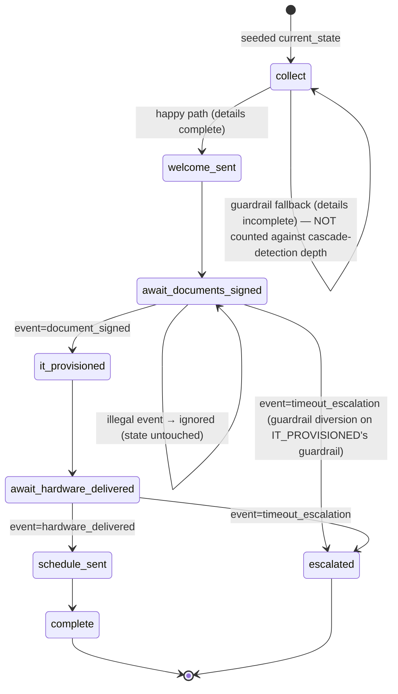

# Software Design Document — Long-Running Event Extension for the Engine

**Status:** Reviewed (2 adversarial passes complete; round 2 found and fixed 3 execution-confirmed breaking bugs) · **Date:** 2026-07-12
**Scope:** Additive extension to `src/engine/*` unifying human-chat and system-event resumption of long-running, pausable workflows; a new `onboarding/` workflow exercising it; a CLI (asyncio + argparse) simulating human/external events in place of FastAPI.

> **Round 2 adversarial pass — headline finding.** The round-1 draft's core mechanism (`aemit_event`/`ainvoke`/`arun_to_completion` always calling with `user_id=""` and, for system/bg calls, `input_message=""`) was checked against the *actual* `src/engine/engine_graph.py`, not just described in the abstract. Running it for real surfaced three bugs that would have silently broken the entire design on first use:
> 1. `invoke()`'s own thread-ID string and `_get_or_init_state()`'s thread-ID string diverge whenever `user_id=""` — every multi-turn resume via `aemit_event` would create a brand-new session instead of resuming (confirmed by executing two turns and inspecting the checkpoint files: turn 2 landed in a fresh, never-before-seen session file, `turn_number` reset to 1, `supporting_docs` never applied — see §5.1).
> 2. `validate_turn_input("")` unconditionally raises `InputValidationError` (confirmed by direct call) — every system-sourced `aemit_event` call and every `arun_to_completion` call passes `input_message=""`, so every one of them would fail validation before ever reaching the graph.
> 3. `JsonCheckpointer.get_sessions()` returns raw session-file dicts with no top-level `"state"` key (confirmed by inspecting real output) — `sweep.py`'s draft (§13) would `KeyError` on the first stale thread it found. This also resolves what was Open Question 3.
>
> A fourth finding invalidates a explicit non-functional claim rather than a code snippet: `compiled_graph.ainvoke()` was run against the existing `JsonCheckpointer` and raised `NotImplementedError`, because LangGraph 1.2.6's execution loop calls `await checkpointer.aget_tuple(...)` directly with no sync-to-async fallback, and neither `JsonCheckpointer` nor `SqliteCheckpointer` overrides it. §14's claim that "`compiled_graph.ainvoke()` should work unmodified" is false as of the installed version — see §5.2.
>
> All four are fixed below, in place, with the corrected code shown alongside the original claim so the failure mode stays visible. Open questions 1–2 were resolved directly with the user (recorded in §12/§2.2); open questions 3–4 are resolved by this round's findings.

---

## 1. Introduction

### 1.1 Background
The engine (`src/engine/`) implements Router → Guardrail → Handler → (loop-or-END) as a LangGraph `StateGraph`. Pause/resume today means "guardrail parks at a `waits_for_input` state without dispatching its handler; the next `invoke()` call resumes by dispatching that state's handler directly with fresh input, then re-enters the graph." This is synchronous and has exactly one event source: a human chat turn. There is no concept of an externally-delivered event (webhook, timeout) distinct from a human typing something, and no async entry point.

### 1.2 Scope
- An async twin of the existing multi-turn entry point (`ainvoke`).
- One unified event gate (`aemit_event`) that both a human chat message and a system/webhook/timeout event flow through.
- Metadata (`wait_kind`, `expected_events`) so a park state can restrict *who* may resume it and *which* event types are legal.
- A `run-to-completion` entry point (`arun_to_completion`) for workflows/runs that must go start-to-terminal in one shot with no interaction ("bg" mode), coexisting with the interactive path ("bg+fg" mode) on the same engine.
- A per-turn `output_messages` convention so handlers — not the engine — decide what, if anything, gets said to a human.
- A new `onboarding/` domain workflow (mirrors `docprocessing/` file-for-file).
- A CLI (`argparse` + `asyncio`) simulating chat and external events; no FastAPI.

### 1.3 Out of scope
Multi-process/multi-worker locking (`asyncio.Lock` is documented as single-process; a real multi-worker deployment would need `pg_advisory_xact_lock`, as discussed for the earlier FastAPI-based design — not built here). Cross-service saga orchestration. Any change to `docprocessing/*` behavior — it must keep passing unmodified.

### 1.4 Backward compatibility
Everything here is additive to `EngineGraph`/`EngineSessionState`/`HandlerMetadata`. Fields are `NotRequired` with defaults that reproduce today's behavior exactly (`current_event_source` defaults to `"human"`, so `_router_node`'s new semantic-router bypass never triggers for docprocessing's existing calls). `docprocessing`'s 12 test files are expected to pass unmodified.

**One exception, called out explicitly:** §5.1 below fixes two latent bugs in the *existing* `invoke()` (thread-ID construction, unconditional input validation). Both bugs are invisible to every current caller — `docprocessing` always passes a non-empty `user_id` and a non-empty `input_message` — and only manifest for the `user_id=""` / `input_message=""` calling convention this design introduces. The fix is a strict narrowing (falls back to today's exact behavior whenever `user_id`/`input_message` are non-empty), so it does not require an "ask first" — but it does mean this design cannot stay purely additive to `engine_graph.py`; `invoke()` itself gets two small, behavior-preserving-for-existing-callers changes. Flagging that distinction here since §1.2's scope list implies invoke() is untouched.

---

## 2. Architecture

```mermaid
flowchart TB
    subgraph CLI["CLI (argparse + asyncio.run); serve mode recommended as primary"]
        C1["chat <thread> <msg>"]
        C2["event <thread> <type> --event-id ID [--payload k=v]"]
        C3["sweep"]
        C4["status <thread>"]
        C5["serve  (long-lived asyncio loop, single process)"]
    end

    C1 -->|source=human| GATE
    C2 -->|source=system, event_id REQUIRED| GATE
    C3 -->|source=system, event_type=timeout_escalation, per stale thread| GATE

    subgraph ENGINE["EngineGraph.aemit_event()  — THE unified gate"]
        GATE["per-thread asyncio.Lock\n→ dedupe (system only, event_id required)\n→ terminal / not-waiting checks\n→ wait_kind / expected_events check\n→ ainvoke()  (user_id always '' — thread_id is identity, never source)"]
    end

    GATE --> AINVOKE["EngineGraph.ainvoke()\n(async twin of invoke)"]
    AINVOKE --> RESUME["resume-at-blocking-state:\ndispatch parked handler w/ fresh input,\nhandler branches on current_event_type"]
    RESUME --> GRAPH["compiled_graph.ainvoke()\nrouter (bypasses semantic router if source=system)\n→ guardrail (incl. timeout-diversion checks)\n→ handler loop — unchanged edges"]
    GRAPH --> CKPT[("JsonCheckpointer / SqliteCheckpointer\n(unchanged)")]
    GATE --> LEDGER[("event_ledger — FILE-BACKED\n(same dir family as checkpointer;\nsurvives across separate CLI process invocations)")]
    C4 --> CKPT
    C3 -.->|enumerate active threads via get_sessions()| CKPT

    BG["EngineGraph.arun_to_completion()\n(bg-only; refuses non-fresh/non-terminal threads)"] --> AINVOKE
```

### 2.2 Components
- **`engine/handler_registry.py`** (extended): `HandlerMetadata` gains `wait_kind` and `expected_events` — and, not previously called out, the `handler(...)` decorator *factory function* itself must gain matching `wait_kind`/`expected_events` keyword parameters that it forwards into `HandlerMetadata(...)`. The dataclass fields alone are not reachable from `@handler(...)` call sites otherwise (found in this round — see §4).
- **`engine/engine_session_state.py`** (extended): `current_event_source`, `current_event_type`, `output_messages`.
- **`engine/engine_graph.py`** (extended): `ainvoke()`, `aemit_event()`, `arun_to_completion()`, async-aware `safe_node`, per-thread `asyncio.Lock` registry, `_router_node` semantic-routing bypass for system-sourced turns. **Also fixes two pre-existing bugs this design's calling convention exposes** (§5.1): `invoke()`'s inline `thread_id = f"{user_id}:{session_id}"` diverges from `_get_or_init_state()`'s guarded version whenever `user_id` is falsy, and `invoke()` unconditionally calls `validate_turn_input(input_message)` even when `input_message == ""`. Both are extracted into two small shared helpers (`_thread_id()`, `_prepare_input()`) called by both `invoke()` and the new `ainvoke()` — this also answers Open Question 4 (yes, they share more than the graph-call line). **Also adds** a public `get_active_sessions()` helper (thin wrapper around the existing `_extract_state_from_checkpoint()`) so `sweep.py` doesn't reach into checkpointer-internal shapes directly (§13).
- **`engine/json_checkpointer.py`** / **`engine/sqlite_checkpointing.py`** (extended — **not previously listed as touched, but required**): neither class currently implements `aget_tuple`/`aget`/`aput` — `BaseCheckpointSaver`'s defaults for these `raise NotImplementedError`, and LangGraph 1.2.6 calls them directly with no sync fallback. Confirmed by running `compiled_graph.ainvoke()` against the existing `JsonCheckpointer` in this repo — it raises `NotImplementedError` today. Both classes need `asyncio.to_thread`-wrapped async counterparts before `ainvoke()` can run at all (§5.2). `SqliteCheckpointer`'s `:memory:` mode additionally needs a serialization guard — see §14.
- **`engine/event_ledger.py`** (new): file-backed dedupe store (`is_processed`/`mark_processed`), same storage family as the checkpointer. **Must be file-backed, not in-memory** — the CLI is a fresh process per one-shot command, so an in-memory ledger never actually dedupes anything across separate invocations (found in adversarial review).
- **`engine/errors.py`** (new): `GraphIncompleteError`, `GraphAlreadyInteractiveError`, `GraphAlreadyCompleteError`, `GraphRunError`. (`GraphRequiresInteractionError` dropped — see §12: the user chose graceful degradation over a raised exception for the needs-input outcome. `GraphAlreadyCompleteError` added — see §12: reusing a `session_id` after it already reached a terminal state is now its own distinguishable error, not silently allowed.)
- **`onboarding/*`** (new): mirrors `docprocessing/*`.
- **`onboarding/cli.py`** (new): `chat` / `event` / `sweep` / `status` / `serve` subcommands. **Confirmed with the user: `serve` (a single long-lived asyncio loop reading simulated events from stdin) is the primary, hardened path** — one-shot subcommands run as separate processes and never exercise real concurrency (the lock is process-local); `serve` is where the lock and concurrent-arrival behavior actually mean something. One-shot subcommands remain supported for scripted/manual poking but are not where correctness effort concentrates.

### 2.3 Principles
No LLM output transitions state (only tool execution in chat paths, only the deterministic event gate in system paths). Skip-prevention is structural (`wait_kind`/`expected_events`), not prompt-level. Side effects are idempotent via guard flags. Timeouts are events, routed through the same gate as any webhook, diverted via ordinary guardrail fallback — no separate mechanism.

---

## 3. State chart (onboarding)



`collect` (`wait_kind="human"`) and the two `await_*` states (`wait_kind="system_event"`) are the only park states, mirroring `UPLOAD_DOCUMENTS`/`HUMAN_REVIEW`'s role in docprocessing, split by *who* may resume them.

**AWAIT handlers must branch on `current_event_type`** (found in adversarial review) — being resumed does not mean the "happy" event fired; it may be a `timeout_escalation` resume that's merely legal, not desired:
```python
def handle_await_documents_signed(state):
    if state.get("current_event_type") == "timeout_escalation":
        return {"audit_trail": ["await_documents_signed: timeout, no signature received"]}
    return {"documents_signed_at": _now(), "audit_trail": ["document_signed event received"]}
```
The actual redirect to `ESCALATED` still happens one hop later, via the guardrail diversion below — this only fixes *what gets recorded*, not *where the run ends up*.

---

## 4. Data model additions

```python
# engine/handler_registry.py
@dataclass
class HandlerMetadata:
    state: str
    waits_for_input: bool = False
    wait_kind: Literal["human", "system_event", "either"] = "either"   # NEW
    expected_events: Optional[list[str]] = None                        # NEW — legal event types to resume this state

# engine/engine_session_state.py (EngineSessionState — generic, additive)
current_event_source: NotRequired[Literal["human", "system"]]   # default "human" if absent
current_event_type: NotRequired[str]                             # default "message" if absent
output_messages: Annotated[list[str], operator.add]              # reducer-backed, like audit_trail
```

`current_event_source`/`current_event_type` live in `state`, not `config["configurable"]`, because domain **guardrails** need to read them (guardrail functions only ever receive `state`), and every call site (`aemit_event`'s human/system branches) stamps them fresh on every turn — never left stale from a prior turn.

`onboarding/session_state.py::OnboardingState(EngineSessionState)` adds `new_hire_details`, guard flags (`welcome_sent`, `it_provisioned`, `schedule_sent`, `hr_notified`), `username_prefix`, `hardware_tracking_id`.

**`handler_registry.py`'s `handler(...)` decorator factory needs new parameters, not just the dataclass** (found this round): today it's
```python
def handler(state: str, waits_for_input: bool = False, description: Optional[str] = None) -> Callable:
    def decorator(func):
        handler_metadata_map[state] = HandlerMetadata(state=state, waits_for_input=waits_for_input, description=description)
        return func
    return decorator
```
Adding `wait_kind`/`expected_events` to `HandlerMetadata` alone is not reachable from any `@handler(...)` call site — every existing usage (see `docprocessing/handlers.py`) calls the *factory function*, which has no way to pass them through. The factory needs the matching new keyword parameters:
```python
def handler(
    state: str,
    waits_for_input: bool = False,
    wait_kind: Literal["human", "system_event", "either"] = "either",   # NEW
    expected_events: Optional[list[str]] = None,                         # NEW
    description: Optional[str] = None,
) -> Callable:
    def decorator(func):
        handler_metadata_map[state] = HandlerMetadata(
            state=state, waits_for_input=waits_for_input,
            wait_kind=wait_kind, expected_events=expected_events, description=description,
        )
        return func
    return decorator
```
All existing `docprocessing` call sites omit the two new kwargs and get `wait_kind="either"` by default — behaviorally inert for them since `aemit_event`'s human branch only special-cases `wait_kind == "system_event"` (§6), which no docprocessing state sets.

**`output_messages` reset points** (mirroring `audit_trail`'s existing treatment, for the same double-counting reason): reset to `[]` in `_get_or_init_state()`'s load-reset, and in `_auto_progress_langgraph`'s `call_state = {**state, ...}` feed-back-in reset. A resume-dispatch handler's delta (e.g. `{"output_messages": ["..."]}` ) is merged into local state via plain dict spread *before* the next `compiled_graph.ainvoke()` call — this is correct, not double-counted, because it is genuinely new information not yet in any checkpoint (verified by tracing the existing `audit_trail` precedent, which relies on the identical mechanism).

`output_messages`, like `audit_trail`, only ever grows in the real persisted checkpoint (the load-time reset is a local Python view, not a truncation) — an accepted, pre-existing tradeoff in this engine, not something newly introduced.

---

## 5. Entry points

| Method | Async? | Who calls it | Behavior |
|---|---|---|---|
| `EngineGraph.invoke(user_id, session_id, input_message, state_delta)` | sync | unchanged, `docprocessing` | existing behavior, byte-for-byte **for non-empty `user_id`/`input_message`**; see §5.1 for the two-bug fix that only changes behavior for the new `""` case |
| `EngineGraph.ainvoke(user_id, session_id, input_message, state_delta)` | async | `aemit_event`, `arun_to_completion` | same algorithm as `invoke`, using `await compiled_graph.ainvoke(...)`; shares the `_thread_id()`/`_prepare_input()` helpers with `invoke` (§5.1) |
| `EngineGraph.aemit_event(thread_id, source, event_type, payload=None, event_id=None)` | async | **the CLI — the one unified gate** | see §6 |
| `EngineGraph.arun_to_completion(user_id, session_id, initial_state_delta, timeout_sec, max_auto_iters=100)` | async | bg/batch callers | see §12 (table previously said "§7" — typo; §7 is the `interrupt()` evaluation, unrelated) |

### 5.1 Two bugs in existing `invoke()` that this design's calling convention triggers

Confirmed by execution, not just inspection: with the running `docprocessing` graph, `graph.invoke(user_id="", session_id="sess-abc", ...)` called twice produced **two independent sessions** instead of one resumed thread — turn 2's `turn_number` came back `1` (fresh state), not `2`, and the `supporting_docs` supplied on turn 2 never reached the handler that was waiting for them. Only one checkpoint file (`_sess-abc.json`) was ever written, under a *different* thread_id than the one `_get_or_init_state` reads from.

**Root cause — two different thread_id formulas in the same method:**
```python
# invoke(), line ~484 — used for config/compiled_graph.invoke()/checkpoint writes:
thread_id = f"{user_id}:{session_id}"                                    # ALWAYS has a colon

# _get_or_init_state(), line ~662 — used to load the initial state:
thread_id = f"{user_id}:{session_id}" if user_id else session_id         # NO colon when user_id is falsy
```
When `user_id` is non-empty (every existing `docprocessing` call), both formulas agree. When `user_id == ""` — the calling convention this design mandates for every `aemit_event`/`arun_to_completion` call (§6, §12) — they disagree: state loads from `session_id`, but the graph run and every checkpoint write for that same call go to `:{session_id}`. Every subsequent call loads from `session_id` again — which never got written — so it's a fresh session every time. This silently breaks 100% of multi-turn resumption through the new unified gate; it's not an edge case, it's the main path.

**Fix — extract one shared helper, use it in both places:**
```python
def _thread_id(self, user_id: str, session_id: str) -> str:
    return f"{user_id}:{session_id}" if user_id else session_id

# invoke(): thread_id = self._thread_id(user_id, session_id)
# _get_or_init_state(): thread_id = self._thread_id(user_id, session_id)
```
This is a strict narrowing — identical output for every non-empty `user_id` — so `docprocessing`'s 12 tests are unaffected.

**Second, independent bug — `validate_turn_input("")` unconditionally raises:**
```python
if not turn_input or len(turn_input.strip()) == 0:
    raise InputValidationError("Input must not be empty")
```
Confirmed by direct call. `invoke()` calls `validate_turn_input(input_message)` unconditionally at its top, before anything else runs. `aemit_event`'s system branch (§6) and `arun_to_completion` (§12) both call `ainvoke(..., input_message="", ...)` by design — every one of them would hit `InputValidationError` and be swallowed by `invoke()`'s own `except InputValidationError` branch, returning a generic `status: "error"` before the graph ever runs. This is not a corner case either — it's the *only* input every system-sourced event and every bg run ever supplies.

**Fix — skip validation/escaping when there's no text to validate, shared via a second helper:**
```python
def _prepare_input(self, input_message: str) -> str:
    """Validate+escape non-empty input; empty input (system/bg turns with
    nothing for a human to have said) skips validation entirely rather than
    being treated as a validation failure."""
    if not input_message:
        return ""
    validate_turn_input(input_message)
    return escape_for_llm(input_message)

# invoke(): escaped = self._prepare_input(input_message)
```
Again a strict narrowing — every existing caller supplies non-empty `input_message`, so behavior for them is unchanged. This also directly answers **Open Question 4** ("should `ainvoke`/`invoke` share more than the graph-call line?") — yes: `_thread_id()` and `_prepare_input()`, both extracted from `invoke()`'s current body, are shared by both.

### 5.2 `compiled_graph.ainvoke()` does not work unmodified against the existing checkpointers

§14 (prior draft) asserted "LangGraph's base class provides default async wrappers that thread-executor-wrap [the sync methods], so `compiled_graph.ainvoke()` should work unmodified — needs a smoke test, not assumed." The smoke test was run this round:
```python
result = await graph.compiled_graph.ainvoke(state, config=config)   # graph uses the existing JsonCheckpointer
# → NotImplementedError
```
`BaseCheckpointSaver.aget_tuple` (installed LangGraph 1.2.6) is `raise NotImplementedError` — there is no default thread-executor fallback to the sync `get_tuple`. LangGraph's own execution loop (`pregel/_loop.py`, `pregel/main.py`) calls `await self.checkpointer.aget_tuple(...)` directly. Neither `JsonCheckpointer` nor `SqliteCheckpointer` overrides `aget_tuple`/`aget`/`aput`, so both inherit the `NotImplementedError` stub. This means `ainvoke()`, and therefore `aemit_event()` and `arun_to_completion()`, cannot run at all today — not a performance concern, a hard crash on the first call. See §14 for the required fix (async wrapper methods on both checkpointer classes, plus a concurrency note for `SqliteCheckpointer`'s in-memory mode).

## 6. `aemit_event` — corrected algorithm

Corrected after adversarial review: **`user_id` is always `""`** when calling `ainvoke` from here — thread identity must never depend on event source (an earlier draft accidentally passed `user_id="human"`/`"system"`, which would have split one logical thread into two checkpointed threads).

```python
async def aemit_event(self, thread_id, source, event_type, payload=None, event_id=None):
    if source == "system" and not event_id:
        raise ValueError("system-sourced events must supply event_id")

    async with self._locks[thread_id]:                                    # asyncio.Lock, defaultdict
        if source == "system" and await self._ledger.is_processed(event_id):
            return {"status": "duplicate", "event_id": event_id}

        state = self._get_or_init_state(session_id=thread_id, user_id="") # thread_id IS identity; user_id="" always
        current = state.get("current_state", "init")
        meta = get_handler_metadata(current)

        if current in self.terminal_states:
            if event_id: await self._ledger.mark_processed(event_id)
            return {"status": "already_terminal", "current_state": current}
        if not does_state_wait_for_input(current):
            return {"status": "not_waiting", "current_state": current}

        if source == "human":
            if meta and meta.wait_kind == "system_event":
                return self._describe_wait(state, meta)                   # read-only reply, state untouched
            result = await self.ainvoke(user_id="", session_id=thread_id,
                input_message=(payload or {}).get("text", ""),
                state_delta={"current_event_source": "human", "current_event_type": "message"})
            return {"status": "ok", **result}

        # source == "system"
        if not meta or meta.wait_kind == "human" or event_type not in (meta.expected_events or []):
            await self._ledger.mark_processed(event_id)                   # consume delivery, don't retry forever
            return {"status": "ignored", "current_state": current, "event_type": event_type}

        result = await self.ainvoke(user_id="", session_id=thread_id, input_message="",
            state_delta={**(payload or {}), "current_event_source": "system", "current_event_type": event_type})
        await self._ledger.mark_processed(event_id)                       # marked AFTER success, not before
        return {"status": "ok", **result}
```

**Fixed this round: the system branch had no symmetric guard against `wait_kind == "human"`.** The human branch explicitly blocks dispatching a `wait_kind="system_event"` handler (line `if meta and meta.wait_kind == "system_event"`), but the system branch's only gate was `event_type not in (meta.expected_events or [])` — with no check of `wait_kind` at all. In practice this was masked because `wait_kind="human"` states (e.g. `COLLECT`) are expected to leave `expected_events` unset, so `event_type not in []` is always true and every system event gets `"ignored"` anyway — but that's relying on a convention (never set `expected_events` on a human-only state), not an enforced invariant. Added `meta.wait_kind == "human"` to the ignore condition so the guard holds structurally even if a future state sets both `wait_kind="human"` and a non-empty `expected_events` for some hybrid reason. This directly serves the existing `§15` "Never" rule for the opposite direction — it was previously enforced for one direction only.

**`_describe_wait(state, meta)` is referenced but never specified** (flagged this round) — needs a concrete signature and return shape before implementation, e.g. `{"status": "waiting", "current_state": ..., "wait_kind": meta.wait_kind, "expected_events": meta.expected_events}`, so a human polling a system-only park state gets something more useful than silence.

**Status vocabulary** (for CLI output / `status` command): `ok`, `duplicate`, `ignored`, `not_waiting`, `already_terminal`, `error`. Each must be distinguishable to whoever is reading CLI output, or the simulator can't demonstrate *why* something didn't happen.

Marking the ledger **after** `ainvoke` succeeds, not before, is deliberate — informed by a bug found in an earlier FastAPI-based reference implementation reviewed in this design process, where marking-then-invoking let a crash in between silently swallow a provider's retry with no recovery path. Here, a retry landing in that same narrow gap just gets correctly reclassified as `"ignored"` (state already moved past that event) rather than reprocessed.

---

## 7. Evaluation: `interrupt()`/`Command()` vs. update-and-reinvoke

**Decision: do not introduce `interrupt()`/`Command()`.**

- The existing pause mechanism (park at a `waits_for_input` state → run ends at `END` → next call resumes by dispatching that state's handler with fresh input) is already an end-and-reenter design, proven by 12 passing docprocessing tests.
- `interrupt()`'s advantage — pausing mid-node, resuming into that exact call frame — isn't needed: every handler here runs start-to-finish in one dispatch, matching the state-level (not sub-node) granularity this design explicitly asked for.
- `interrupt()`'s hard rule (resume only via `Command(resume=...)`, never a fresh `invoke()`) is exactly the hazard class that produced real bugs in an earlier FastAPI-based design reviewed in this process. Introducing it here would require every call path to check for a pending interrupt first — a bigger, riskier change to gain a capability nothing here needs.
- The one thing `interrupt()` gives for free — a structured "here's what I'm waiting for" object — is already available via `current_state` + `HandlerMetadata.expected_events` in the checkpoint.

## 8. Diversion mechanism (timeouts) — guardrail-based, not a new router hook

A router-bypass hook (`_get_event_transitions()`) was drafted and rejected: `happy_path` already proposes the normal next state regardless of which legal event resumed a park state, and that state's own guardrail already runs before its handler dispatches — so diversion is just one more guardrail check:

```python
def check_not_timeout_escalation(state) -> GuardrailResult:
    if state.get("current_event_type") == "timeout_escalation":
        return GuardrailResult(passed=False, reason="timeout escalation", fallback=State.ESCALATED)
    return GuardrailResult(passed=True)

guardrails[State.IT_PROVISIONED] = make_guardrail(
    check_not_timeout_escalation, check_transition_allowed, check_fallback_depth,
)
```

Zero new engine mechanism — the same `GuardrailResult(fallback=...)` pattern `check_validated_data_present` already uses in docprocessing.

**`COLLECT`'s guardrail must NOT reuse the generic cascade-detection guardrail as-is** (found in adversarial review): `check_fallback_depth` (`max_depth=2`) is designed to catch automated retry loops, but `COLLECT`'s self-fallback fires on every ordinary turn where the human hasn't yet supplied all three fields — a normal three-clarifying-turn conversation would hit the cascade cap and get killed to `ERROR` even though nothing is actually looping.
```python
guardrails[State.COLLECT] = make_guardrail(check_transition_allowed)   # no check_fallback_depth here
```
If a bound on collection length is wanted, use a purpose-built check reading `state["turn_number"]` with a much larger threshold — a distinct concept from automated-cascade detection, not the same field.

## 9. Router change: bypass semantic routing for system-sourced turns

One-line addition to `_router_node`: only attempt semantic routing `if self.semantic_router is not None and state.get("current_event_source") != "system"`. Code-table routing (already the existing exception-fallback path) becomes unconditional for system events — an LLM can never decide a system-event transition, structurally, regardless of whether a `semantic_router` is attached.

## 10. Collect node

`handle_collect` uses a LangChain tool-calling agent (`create_agent`, single bound tool `submit_new_hire`) — tool execution, not model prose, performs the transition; the node intercepts the tool call and applies the guarded, idempotent state delta itself. `IT_PROVISIONED`'s username selection stays a plain `make_chain`-style LCEL chain (deterministic, single-shot).

## 11. Message/output convention

Replaces the previous unconditional `[HumanMessage(...), AIMessage(f"Transitioned to {state}")]` append on every turn:

```python
if input_message:                                          # truthy → human actually said something
    new_messages = [HumanMessage(content=input_message, additional_kwargs={"turn_number": turn})]
else:
    new_messages = []

outs = state.get("output_messages", [])
if outs:
    new_messages += [AIMessage(content=m, additional_kwargs={"turn_number": turn, "state": current_state}) for m in outs]
elif state.get("current_event_source", "human") == "human":
    new_messages.append(AIMessage(content=f"Transitioned to {current_state}"))   # fallback, human turns only
# system-sourced turn with no output_messages → new_messages stays [] → messages untouched this turn

if new_messages:
    messages.extend(new_messages)
    state["messages"] = messages
    self.compiled_graph.update_state(config, {"messages": new_messages})
```

Backward compatible with docprocessing (no handler there sets `output_messages`, so every turn still hits the fallback branch, producing the same message it does today). System-sourced turns with nothing to say leave `messages` completely untouched — closes the checkpoint-bloat / meaningless-empty-turn concern raised earlier for a prior chat-unification design.

## 12. `arun_to_completion` — corrected (twice)

**Round-1 correction** (kept): refuse a thread that's already mid-flow, rather than silently misapplying `initial_state_delta` as if it were a resume payload for whatever state the thread happens to be parked at.

**Round-2 finding: the round-1 check didn't actually do that for terminal threads.** The diagram in §2.1 annotates this method "refuses non-fresh/non-terminal threads" — but the round-1 code's guard, `if current not in ("init",) and current not in self.terminal_states`, only raises when *both* conditions hold, i.e. it refuses mid-flow threads but explicitly *allows* re-running `arun_to_completion` against an already-`COMPLETE`d (or already-`ERROR`ed) `session_id`. Traced what actually happens: `initial_state_delta` gets merged over the finished record's persisted business fields, `compiled_graph.invoke()`/`ainvoke()` runs with `current_state` still `"complete"` (or `"error"`), the router tries `routing_table[current]` — but terminal states are never routing-table keys (confirmed against `docprocessing/state_transitions.py`: `happy_path` has no entry for `COMPLETE` or `ERROR`) — so `_router_node` raises `ValueError`, caught by `safe_node`, and the run ends in `status: "error"`. So this doesn't corrupt silently forever, but it does: (a) surface a confusing "state not in routing table" error instead of a clear "already completed" one, and (b) still checkpoint the corrupted merge of `initial_state_delta` over the finished record's business fields *before* the router fails, since LangGraph seeds and checkpoints the graph's initial channel values before running any node. A second `arun_to_completion` call against a finished thread is a real scenario (e.g. a bg scheduler that doesn't track completion itself, or two racing triggers for the same initial event) — this is exactly the class of bug the round-1 correction was meant to close, just not for the terminal case.

**Fix — reject reuse of a non-fresh `session_id` outright, with a distinct error for the terminal case so callers can tell "still running elsewhere" apart from "already done, use a new session_id":**
```python
async def arun_to_completion(self, user_id, session_id, initial_state_delta, timeout_sec=10.0, max_auto_iters=100):
    existing = self._get_or_init_state(session_id=session_id, user_id="")
    current = existing.get("current_state", "init")
    if current != "init":
        if current in self.terminal_states:
            raise GraphAlreadyCompleteError(
                f"thread '{session_id}' already finished at '{current}' — "
                "call arun_to_completion() with a new session_id for a new run"
            )
        raise GraphAlreadyInteractiveError(
            f"thread '{session_id}' is parked at '{current}' — use aemit_event(), not arun_to_completion()"
        )

    result = await self.ainvoke(user_id="", session_id=session_id, input_message="",
                                 state_delta=initial_state_delta, timeout_sec=timeout_sec)
    if result.get("status") == "error":
        raise GraphRunError(result.get("error_message"))

    current = result.get("current_state")
    if does_state_wait_for_input(current):
        # Confirmed with the user: degrade gracefully instead of raising.
        # A bg/batch caller treats "this run needs a human/system event to
        # continue" as a normal outcome, not an exception — and can hand
        # `result` straight to aemit_event() later without re-deriving state.
        return {"status": "blocked_needs_input", **result}
    if current not in self.terminal_states:
        raise GraphIncompleteError(f"stopped at '{current}' without reaching terminal (max_auto_iters={max_auto_iters}?)")
    return result
```

`max_auto_iters` defaults higher than the interactive default (10) — nobody is watching a bg run to notice silent truncation.

**Open Question 1 — resolved with the user:** graceful degradation (`{"status": "blocked_needs_input", ...}`), not `GraphRequiresInteractionError`. `GraphRequiresInteractionError` is dropped from §2.2's error list accordingly.

## 13. Timeout sweep

**Round-2 finding — this resolves what was Open Question 3.** The round-1 draft assumed `session["state"]` off `JsonCheckpointer.get_sessions()`'s output without checking the actual shape (the open question said as much). Checked it against the real checkpointer this round: `get_sessions()` returns the raw session-file dict — `{"thread_id", "checkpoints": {checkpoint_id: {"checkpoint", "metadata", "ts_created"}}, "metadata", "created_at", "updated_at", "latest_checkpoint_id", "pause_checkpoint_id"?, "pause_timestamp"?}` — confirmed by inspecting a real session file. **There is no top-level `"state"` key.** `sweep.py` as drafted would `KeyError` on the very first session it enumerated. Extracting the actual state dict requires the same checkpoint-unwrapping logic `_extract_state_from_checkpoint()` already implements (pick `pause_checkpoint_id` or fall back to `latest_checkpoint_id`, then unwrap `checkpoint["channel_values"]`/`checkpoint["values"]`).

**Fix — add a public `EngineGraph.get_active_sessions()` that does this unwrapping once, so `sweep.py` (and any future caller) never depends on the checkpointer's internal file shape directly:**
```python
# engine/engine_graph.py — new method, reuses the existing _extract_state_from_checkpoint
def get_active_sessions(self) -> list[dict[str, Any]]:
    """Enumerate sessions as {"thread_id": ..., "state": {...}} — hides the
    checkpointer's internal file/row shape from callers like sweep.py."""
    checkpointer = self.compiled_graph.checkpointer
    results = []
    for session in checkpointer.get_sessions():
        checkpoint_id = session.get("pause_checkpoint_id") or session.get("latest_checkpoint_id")
        cp_entry = (session.get("checkpoints") or {}).get(checkpoint_id) if checkpoint_id else None
        if not cp_entry:
            continue
        checkpoint_tuple = CheckpointTuple(
            config={}, checkpoint=cp_entry.get("checkpoint", {}), metadata=cp_entry.get("metadata", {})
        )
        state = self._extract_state_from_checkpoint(checkpoint_tuple)
        if state is not None:
            results.append({"thread_id": session["thread_id"], "state": state})
    return results
```
```python
# onboarding/sweep.py — now reads through get_active_sessions(), not the raw checkpointer
async def sweep(graph, thresholds: dict[str, float]) -> list[dict]:
    results = []
    for session in graph.get_active_sessions():
        state = session["state"]
        current = state.get("current_state")
        if current in thresholds and _stale(state, thresholds[current]):
            results.append(await graph.aemit_event(
                thread_id=session["thread_id"], source="system",
                event_type="timeout_escalation", event_id=f"sweep:{session['thread_id']}:{current}",
            ))
    return results
```
Note this assumes `SqliteCheckpointer` will need an equivalent `get_sessions()` (it currently has none — only `JsonCheckpointer` does) if `sweep.py` is ever run against a SQLite-backed graph; out of scope for `onboarding/` (which uses `JsonCheckpointer` per §2.2) but worth flagging so it isn't assumed to "just work" later.

Deterministic `event_id` (`sweep:{thread_id}:{state}`, not timestamp-based) means overlapping sweep runs correctly dedupe against each other via the now file-backed ledger.

---

## 14. Non-functional notes
- **Concurrency**: per-thread `asyncio.Lock` is correct only within a single long-lived process — `serve` mode is where it actually matters (confirmed with the user as the primary path, §2.2); one-shot CLI commands never exercise real concurrent access regardless of lock/ledger implementation. The `self._locks` `defaultdict(asyncio.Lock)` also never evicts entries — in a long-lived `serve` process this grows by one `asyncio.Lock` per distinct `thread_id` ever seen, for the life of the process. Low severity (a bare `asyncio.Lock` is a handful of bytes; this would take an enormous number of distinct threads to matter), but worth a one-line acknowledgment rather than silence, since `serve` is the hardened long-running path.
- **Ledger persistence**: must be file/SQLite-backed, not in-memory (§2.2) — an in-memory ledger is a no-op across the CLI's realistic (separate-process) usage pattern.
- **Async checkpoint compatibility — the round-1 claim was checked and is false as of the installed version.** `JsonCheckpointer`/`SqliteCheckpointer` only implement sync `BaseCheckpointSaver` methods. The round-1 draft claimed LangGraph's base class thread-executor-wraps them by default. Checked against the installed `langgraph==1.2.6`: `BaseCheckpointSaver.aget_tuple` (and `aget`/`aput`) is `raise NotImplementedError` with no sync fallback, and LangGraph's execution loop calls `await checkpointer.aget_tuple(...)` directly (`pregel/_loop.py`, `pregel/main.py`). Ran `await graph.compiled_graph.ainvoke(...)` against the real `JsonCheckpointer` in this repo — it raised `NotImplementedError` immediately. **Required fix, not optional:** both checkpointer classes need explicit async methods:
  ```python
  # JsonCheckpointer / SqliteCheckpointer — add:
  async def aget_tuple(self, config): return await asyncio.to_thread(self.get_tuple, config)
  async def aget(self, config):       return await asyncio.to_thread(self.get, config)
  async def aput(self, config, checkpoint, metadata, new_versions):
      return await asyncio.to_thread(self.put, config, checkpoint, metadata, new_versions)
  ```
  `JsonCheckpointer` is safe to wrap this way as-is — each `thread_id` maps to its own file, opened/closed per call, so concurrent `asyncio.to_thread` calls for *different* `thread_id`s never touch shared mutable state. **`SqliteCheckpointer` is not automatically safe**: its `:memory:` mode holds one module-level `_memory_conn` shared across *every* instance and *every* thread_id, and `sqlite3.Connection` objects are not safe for concurrent use from multiple threads even with `check_same_thread=False` (that flag only disables the same-thread assertion, it does not add concurrency safety) — two `aemit_event` calls for two *different* `thread_id`s, each holding its own per-thread `asyncio.Lock`, could still dispatch concurrently onto the shared connection via the thread pool and race (`sqlite3.OperationalError: database is locked`, or worse). File-backed `SqliteCheckpointer` (non-`:memory:`) opens a fresh connection per call today, which avoids the shared-connection race but can still hit SQLite's own file-locking under concurrent writers. **Fix**: add one `asyncio.Lock` (or a `threading.Lock`, since the work happens in a thread-pool thread) shared across all of `SqliteCheckpointer`'s async methods, serializing access to `_memory_conn`/the file — the same "correct only within one process" tradeoff already accepted for `aemit_event`'s per-thread lock (§14, above), just applied at the connection level instead of the thread_id level. `onboarding/` uses `JsonCheckpointer` (§2.2) so this doesn't block that domain, but the checkpointer-level fix should ship alongside it rather than being deferred, since the same `EngineGraph.ainvoke()` will be reused by any future `SqliteCheckpointer`-backed domain.
- **Reliability**: no `aupdate_state`-then-separate-`ainvoke` split anywhere in this design (unlike the earlier FastAPI reference) — `ainvoke()` is one call, and LangGraph's own per-superstep checkpointing handles a crash mid-sequence.
- **Security**: the CLI's `event` command is deliberately unauthenticated (local simulator) — not a template for a real webhook endpoint, which would need the HMAC verification discussed for the earlier FastAPI-based design.
- **Test tooling gap (found this round):** `pyproject.toml`'s dev dependencies are `pytest`, `pytest-cov`, `ruff`, `mypy` — **no `pytest-asyncio` (or `anyio`), and no `asyncio_mode` configured** in either `pytest.ini` or `[tool.pytest.ini_options]`. Every new entry point this design adds (`ainvoke`, `aemit_event`, `arun_to_completion`) is `async def`. Without `pytest-asyncio` installed and `asyncio_mode = "auto"` (or explicit `@pytest.mark.asyncio` decorators) configured, `async def test_...` functions silently do not run as coroutines under plain pytest — they'd need to be added before any test in §16 can execute. See §16.

## 15. Boundaries

**Always**: guardrails re-validate `check_transition_allowed` even on system-forced resumes; every side-effect handler keeps a guard flag independent of `expected_events` legality; AWAIT handlers branch on `current_event_type` rather than assuming the happy event fired; `invoke()`/`ainvoke()` compute `thread_id` via the single shared `_thread_id()` helper (§5.1) — never inline `f"{user_id}:{session_id}"` at a second call site.
**Ask first**: changing `docprocessing/*` behavior to adopt any of this; removing the ledger's file-backing before a real multi-process deployment is planned.
**Never**: let `_router_node`'s semantic router run for `current_event_source == "system"`; let a human-sourced `aemit_event` call dispatch a `wait_kind="system_event"` handler; let a system-sourced `aemit_event` call dispatch a `wait_kind="human"` handler (§6 — now enforced structurally, not just by the convention of leaving `expected_events` unset); call `arun_to_completion` against a thread known to be mid-flow, **or against a thread already at a terminal state** (§12 — both now raise, distinguishably: `GraphAlreadyInteractiveError` vs. `GraphAlreadyCompleteError`).

## 16. Testing strategy

Not present in the round-1 draft — added this round since none of the new async surface can be exercised without it, and the existing 80%-coverage gate (`pytest.ini`'s `--cov-fail-under=80`, which takes precedence over `pyproject.toml`'s `[tool.pytest.ini_options]` since both exist) applies to `src/` as a whole, including every new file here.

1. **Tooling prerequisite**: add `pytest-asyncio` to `[project.optional-dependencies].dev` and set `asyncio_mode = "auto"` in `pytest.ini` (or mark each async test with `@pytest.mark.asyncio`) — see §14. Nothing below runs without this.
2. **`engine/` unit tests** (new `tests/test_event_ledger.py`, extend `tests/test_graph_methods.py` or add `tests/test_engine_async.py`):
   - `_thread_id()`/`_prepare_input()` (§5.1): equivalence with the old inline formulas for non-empty `user_id`/`input_message`; divergent, correct behavior for `user_id=""`/`input_message=""`.
   - `aget_tuple`/`aput` async wrappers on `JsonCheckpointer` (§14): round-trip a checkpoint through the async path; confirm `compiled_graph.ainvoke()` no longer raises `NotImplementedError` (this is the regression test for §5.2's finding).
   - `event_ledger.is_processed`/`mark_processed`: persists across two separate instances pointed at the same directory (simulating two CLI process invocations) — the scenario an in-memory ledger would fail.
   - `aemit_event`'s status vocabulary: one test per status (`ok`, `duplicate`, `ignored`, `not_waiting`, `already_terminal`), including the `wait_kind` symmetric-guard case from §6 (system event against a `wait_kind="human"` state → `ignored`, even if `expected_events` happened to be non-empty).
   - `arun_to_completion`'s three outcomes: `GraphAlreadyInteractiveError` (mid-flow reuse), `GraphAlreadyCompleteError` (terminal reuse — the regression test for §12's finding), `{"status": "blocked_needs_input", ...}` (parked at a wait state).
3. **`onboarding/` integration test** (new `tests/test_onboarding_flow.py`, mirroring `tests/test_multi_turn.py`'s shape): drive the full state chart (§3) end-to-end through `aemit_event` — human `collect` turn → `document_signed` system event → `hardware_delivered` system event → `complete`; a second run exercising the `timeout_escalation` diversion at each `AWAIT_*` state to `ESCALATED`; a duplicate-`event_id` delivery asserting `"duplicate"` and no double-processing (state unchanged, `audit_trail` not appended twice).
4. **`docprocessing/` regression**: run its existing 12 test files unmodified after every change to `engine/*` in this design — this is the actual mechanism enforcing §1.4's backward-compatibility claim, not just a written assertion.

## Open questions

All four resolved this round — none outstanding.

1. ~~`arun_to_completion`'s failure-mode choice~~ — **resolved with the user**: graceful degradation (`{"status": "blocked_needs_input", ...}`), see §12.
2. ~~`serve`-as-primary vs. one-shot-as-primary~~ — **resolved with the user**: `serve` is the primary, hardened path; one-shot subcommands remain supported but aren't where correctness effort concentrates, see §2.2.
3. ~~`get_sessions()`'s exact return shape~~ — **resolved by inspection this round**: no top-level `"state"` key; see §13's `get_active_sessions()` fix.
4. ~~Should `ainvoke`/`invoke` share more than the graph-call line~~ — **resolved this round**: yes, `_thread_id()` and `_prepare_input()`, extracted while fixing the two bugs in §5.1.
