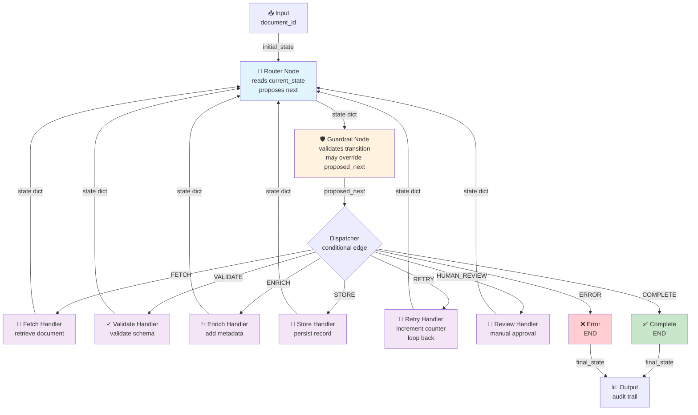
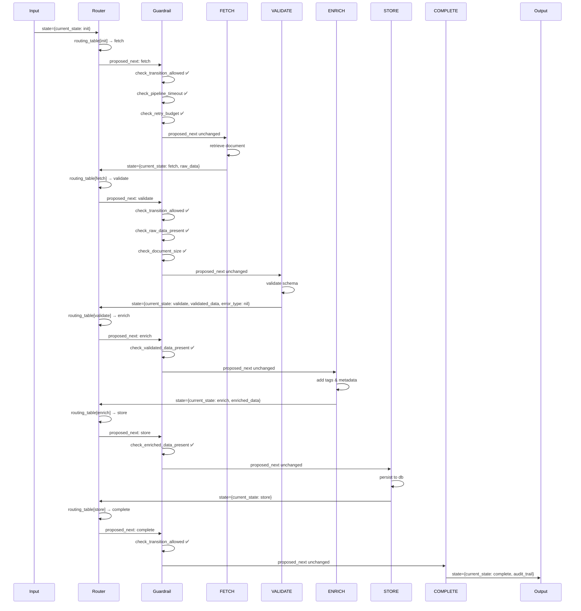
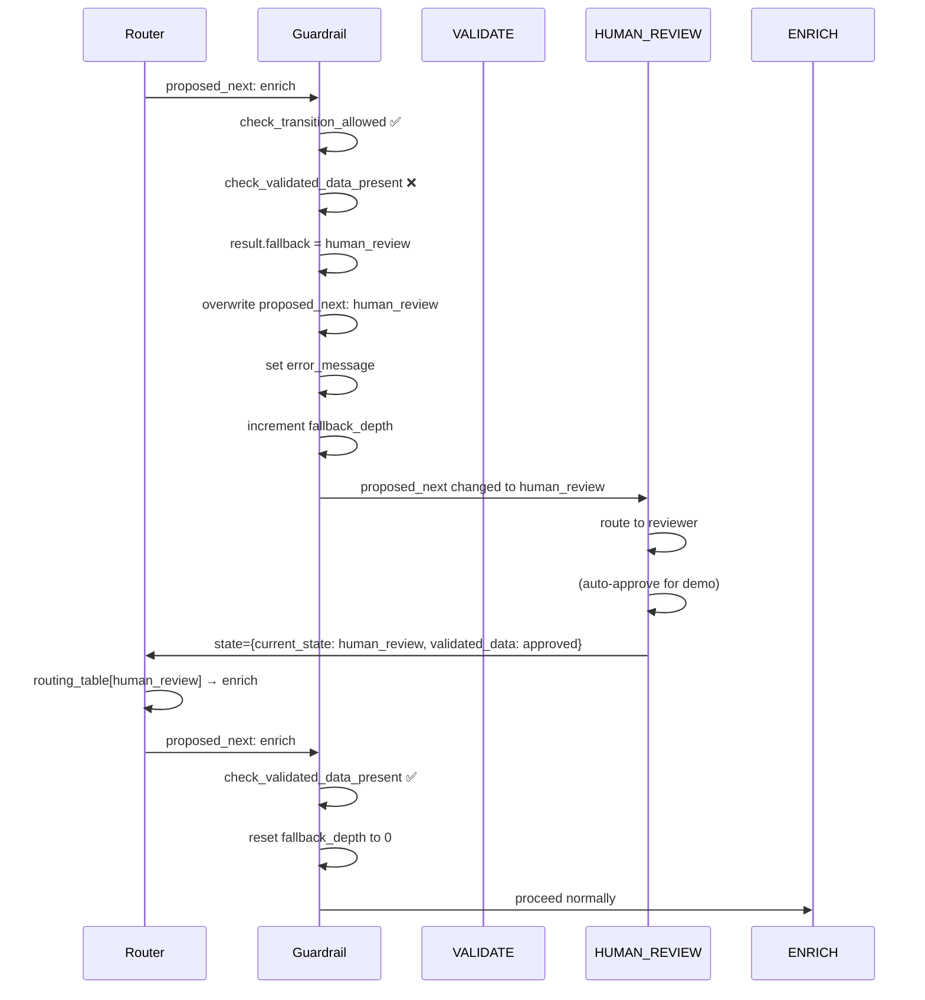
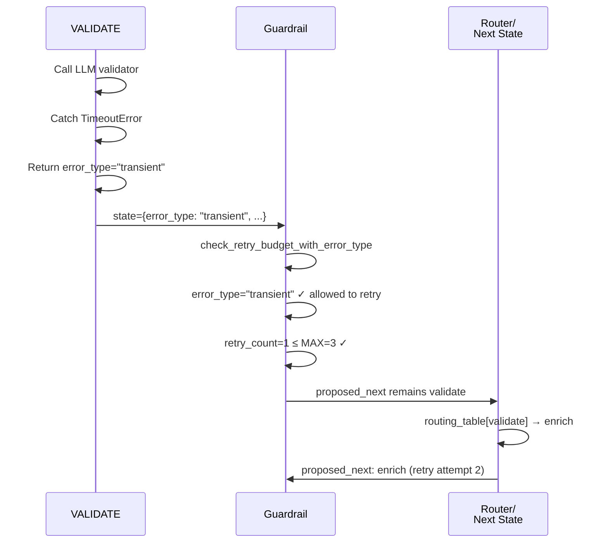
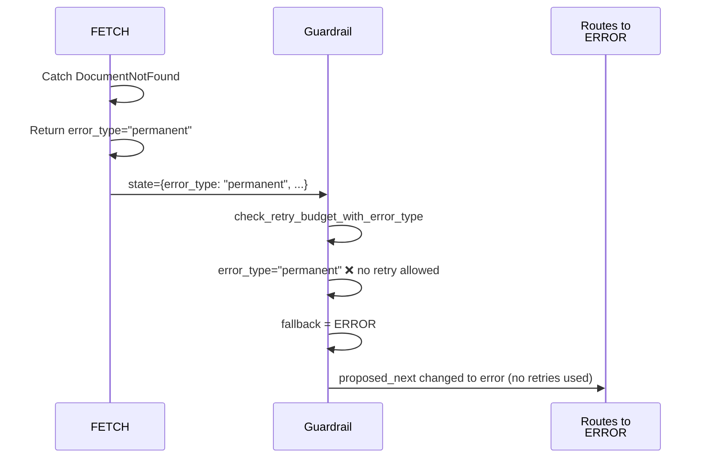
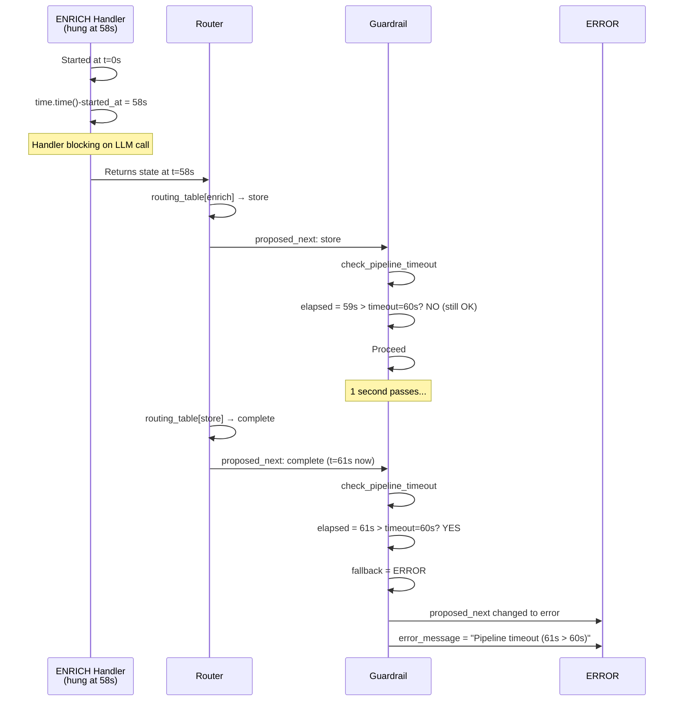

# Software Design Document: LangGraph State Machine Workflow
_Date: 2026-06-20_
_Status: Final (Adversarial Review Incorporated)_

---

## SECTION 1 — Introduction & Purpose

### 1.1 Background

The current agno-based document processing system successfully implements a **Router-Dispatcher production pattern** with five key components: state machine definition, router, guardrails, handlers, and fallback mechanisms. This approach scored highest (51/60) in architectural evaluation and is proven in production.

This design ports that **Router-Dispatcher pattern directly to LangGraph**, Anthropic's graph execution framework. LangGraph provides native support for state graphs, conditional routing, and persistence—aligning naturally with our state machine architecture. The port preserves the five-element pattern exactly while leveraging LangGraph's graph semantics and checkpoint/resume capabilities.

### 1.2 Architecture Pattern: Router-Dispatcher in LangGraph

**Why this approach:**
- ✅ **Low risk** — directly ports proven agno pattern (no architectural innovation)
- ✅ **Guardrail-driven** — composable pure-function checks, easy to test
- ✅ **Production-ready** — already validated in agno; LangGraph just executes it
- ✅ **Multi-turn capable** — future parent loop wraps this graph without changes
- ✅ **Separation of concerns** — engine code vs. pipeline code clearly separated

**The Five Elements:**
1. **State Machine** — defines states (INIT, FETCH, VALIDATE, ENRICH, STORE, COMPLETE, RETRY, HUMAN_REVIEW, ERROR) and allowed transitions
2. **Router** — reads current_state and proposes the next state using a pure-code routing table
3. **Guardrails** — validates the proposed transition; may override with a fallback state
4. **Handler** — executes business logic only if guardrail passes
5. **Fallback** — routes to RETRY, HUMAN_REVIEW, or ERROR when guardrail fails

**LangGraph Graph Structure:**
```
StateGraph
├── Node: Router         (reads current_state → proposes next)
├── Node: Guardrail      (validates transition, may rewrite proposed_next)
└── Conditional Edge: Dispatcher (proposed_next → handler node)
    ├── Handler: FETCH
    ├── Handler: VALIDATE
    ├── Handler: ENRICH
    ├── Handler: STORE
    ├── Handler: COMPLETE (END)
    ├── Handler: RETRY    (loops back to Router)
    ├── Handler: HUMAN_REVIEW (loops back to Router)
    └── Handler: ERROR (END)
```

### 1.3 Scope

**In Scope:**
- LangGraph state machine engine (reusable across pipelines)
- Document processing pipeline implementation
- One-turn execution (INIT → COMPLETE/ERROR)
- Session persistence via LangGraph checkpoints
- Audit trail capture and replay
- Guardrails with composable checks and fallback routing
- Error type classification (transient vs permanent)
- Safety guards: timeouts, document size limits, fallback cascade detection
- Production-ready reference implementation

**Out of Scope:**
- Multi-turn conversations (future: wrap graph in per-turn parent loop)
- Async/await execution
- Distributed execution
- LLM-powered semantic routing (optional future)

### 1.4 Goals

1. Port Router-Dispatcher pattern to LangGraph with zero behavioral changes
2. Separate reusable engine code from domain-specific pipeline code
3. Provide reference implementation teams can replicate
4. Enable future multi-turn conversations without rewrite
5. Maintain audit trails and error recovery from current system
6. Add safety guards: timeouts, size limits, cascade detection, comprehensive error handling

---

## SECTION 2 — System Architecture

### 2.1 High-Level Architecture



**Execution Flow:**
1. **Entry**: StateGraph invoked with initial state (current_state="init", document_id=X, started_at=now)
2. **Router**: Reads current_state, looks up routing table, sets proposed_next
3. **Guardrail**: Validates proposed transition; may rewrite proposed_next to fallback (with checks for timeout, error_type, cascade depth)
4. **Dispatcher**: Conditional edge routes to handler based on proposed_next
5. **Handler**: Executes business logic, returns updated state with new current_state and error_type (if error)
6. **Loop**: Non-terminal handlers edge back to Router; terminal handlers (COMPLETE, ERROR) exit to END

### 2.2 Components

#### **Router Node**
- **Input:** PipelineState with current_state set
- **Logic:** Pure code function reads routing table (happy-path: INIT→FETCH, FETCH→VALIDATE, etc.)
- **Output:** Same state dict with proposed_next set
- **Audit:** Appends "router: A → B" to audit_trail
- **Reusability:** Can be replaced per pipeline (e.g., LLM-powered router for conversations)

#### **Guardrail Node**
- **Input:** PipelineState with proposed_next set
- **Logic:** Looks up GUARDRAILS[proposed_next], runs composed checks
- **Checks:** Pure functions (check_transition_allowed, check_retry_budget_with_error_type, check_fallback_depth, check_pipeline_timeout, check_document_size, etc.)
- **Fallback:** On failure, overwrites proposed_next with fallback state and sets error_message
- **Cascade Detection:** Increments fallback_depth on each redirect; aborts if > 2
- **Output:** Updated state dict ready for dispatch
- **Audit:** Appends "guardrail PASS → X" or "guardrail FAIL → X (reason) → fallback Y"
- **Composability:** make_guardrail(*checks) composes multiple checks with short-circuit evaluation

#### **Dispatcher (Conditional Edge)**
- **Selector Function:** guardrail_router(state) returns state["proposed_next"]
- **Choices:** Maps proposed_next value to handler node name
- **Routing:** LangGraph's conditional_edges routes to the correct handler
- **Loop Binding:** Non-terminal handlers define edge back to "router"; terminal handlers edge to END

#### **Handler Nodes** (8 total)
- **Signature:** (PipelineState) → PipelineState
- **Contract:** 
  - Each handler MUST set current_state to its own state value on return
  - MUST catch ALL exceptions (Exception, not specific types)
  - SHOULD set error_type = "transient" or "permanent" on exception
  - MUST log exceptions with exc_info=True
- **Execution:** Only runs if guardrail passed (guardrail can redirect before handler runs)
- **Side-effects:** Can call LLM agents, I/O, etc.; exceptions caught and moved to ERROR
- **Audit:** Appends outcome (OK, FAILED, EXCEPTION) to audit_trail
- **Non-terminal:** FETCH, VALIDATE, ENRICH, STORE, RETRY, HUMAN_REVIEW → edge to "router"
- **Terminal:** COMPLETE, ERROR → edge to END

#### **State Dict (PipelineState) — ENHANCED**
```python
{
  # control plane
  current_state: str              # active state
  proposed_next: str              # router's proposal
  retry_count: int                # incremented on RETRY (0-3)
  error_message: Optional[str]    # set by guardrail on failure
  error_type: Optional[str]       # "transient" or "permanent"
  fallback_depth: int             # cascade counter (0-2)
  audit_trail: list[str]          # append-only log (max 1000 entries)

  # execution tracking
  started_at: float               # timestamp when graph invoked
  node_timeout_seconds: int       # global timeout (default 60)

  # business payload
  document_id: str
  raw_data: Optional[dict]        # from FETCH
  validated_data: Optional[dict]  # from VALIDATE
  enriched_data: Optional[dict]   # from ENRICH
}
```

### 2.3 Architecture Principles

1. **Pure Functions** — Router and guardrails are pure code; no side-effects beyond state dict mutation
2. **Composable Guardrails** — Guards compose via make_guardrail(*checks); first failure short-circuits
3. **Explicit Fallback** — No branching in handler logic; guardrail failure overwrites proposed_next
4. **Audit Trail** — Append-only log (capped at 1000 entries) captures all routing decisions and handler outcomes
5. **State as Flow** — All data flows through state dict; no closure-captured context
6. **Reusable Engine** — Base engine code (Router, Guardrail nodes, StateGraph builder) is domain-agnostic
7. **Domain-Specific Pipeline** — State enum, routing table, handler map, guardrails defined per pipeline
8. **Session Persistence** — LangGraph's checkpoint mechanism saves state at each node; enables resume
9. **Error Recovery** — Guardrails route to RETRY (transient) or HUMAN_REVIEW (permanent); fallback prevents cascading failures
10. **Safety Guards** — Timeouts, size limits, cascade detection, and comprehensive exception handling prevent resource exhaustion and infinite loops

---

## SECTION 3 — Workflow / Use Cases

### 3.1 Happy Path: Document Processing (Success Case)

**Scenario:** Document passes all validation, enrichment, and storage checks.



**Audit Trail:**
```
1. init
2. router: init → fetch
3. guardrail PASS → fetch
4. fetch OK
5. router: fetch → validate
6. guardrail PASS → validate
7. validate OK
8. router: validate → enrich
9. guardrail PASS → enrich
10. enrich OK
11. router: enrich → store
12. guardrail PASS → store
13. store OK
14. router: store → complete
15. guardrail PASS → complete
16. COMPLETE ✅
```

---

### 3.2 Guardrail Redirection: Missing Validated Data

**Scenario:** Validation fails (schema_version missing). Guardrail detects absence of validated_data and redirects to HUMAN_REVIEW.



**Audit Trail Snippet:**
```
...
4. validate FAILED – schema_version missing
5. router: validate → enrich
6. guardrail FAIL → enrich (validated_data is absent) → fallback human_review
7. human_review: APPROVED
8. router: human_review → enrich
9. guardrail PASS → enrich
10. enrich OK
...
```

---

### 3.3 Error Type Classification: Transient vs Permanent

**Scenario:** VALIDATE handler encounters an error. It distinguishes:
- **Transient** (TimeoutError) → Should retry
- **Permanent** (DocumentNotFound) → Should not retry, go to human review or error



**vs. Permanent Error:**



---

### 3.4 Safety Guard: Timeout Protection

**Scenario:** Pipeline exceeds 60-second timeout. Guardrail detects and routes to ERROR before next handler.



---

### 3.5 Use Case Summary Table

| Use Case | Entry | Path | Exit | Recovery |
|----------|-------|------|------|----------|
| **Happy Path** | INIT | F→V→E→S→C | COMPLETE | None needed |
| **Validation Fail** | INIT | F→V fail → HR→E→S→C | COMPLETE | Human Review |
| **Transient Error** | INIT | F fail (timeout) → R → F → V→... | COMPLETE | Auto Retry |
| **Permanent Error** | INIT | F fail (not found) → E | ERROR | Manual investigation |
| **Timeout Exceeded** | Any | ... → guardrail timeout detected | ERROR | Manual investigation |
| **Document Too Large** | INIT | F→V check size → E | ERROR | Reject oversized input |
| **Cascade Loop** | Any | HR→E→validate fail→HR (×3) | ERROR | Prevent infinite loop |

**Legend:** F=FETCH, V=VALIDATE, E=ENRICH, S=STORE, C=COMPLETE, HR=HUMAN_REVIEW, R=RETRY

---

## SECTION 4 — Data Models

### 4.1 PipelineState TypedDict — ENHANCED

The central data structure that flows through every node. All mutations happen to this dict.

```python
class PipelineState(TypedDict):
    # ─ Control Plane ─────────────────────────────────────────────────────
    current_state:       str                      # Active state (set by handler)
    proposed_next:       str                      # Router's proposal (overridable by guardrail)
    retry_count:         int                      # Incremented on RETRY (0-3)
    error_message:       Optional[str]            # Set by guardrail on failure
    error_type:          Optional[str]            # "transient", "permanent", or None
    audit_trail:         list[str]                # Append-only log (max 1000 entries)
    fallback_depth:      int                      # Guardrail fallback cascade counter (0-2)

    # ─ Execution Tracking ────────────────────────────────────────────────
    started_at:          float                    # Timestamp when graph invoked
    node_timeout_seconds: int                     # Global timeout (default 60)

    # ─ Business Payload ──────────────────────────────────────────────────
    document_id:         str                      # Unique document identifier
    raw_data:            Optional[dict[str, Any]] # From FETCH; cleared on RETRY
    validated_data:      Optional[dict[str, Any]] # From VALIDATE; required for ENRICH
    enriched_data:       Optional[dict[str, Any]] # From ENRICH; required for STORE
```

**Field Semantics:**

| Field | Owner | Lifecycle | Purpose |
|-------|-------|-----------|---------|
| `current_state` | Handler | Set on each handler exit | Tells router where we are |
| `proposed_next` | Router, Guardrail | Set by router; overwritten by guardrail | Next state candidate |
| `retry_count` | RETRY handler | Incremented by 1 (0→1→2→3) | Guards max retry check |
| `error_message` | Guardrail, Handler | Set on guardrail or handler failure | Explains why fallback/error triggered |
| `error_type` | Handler | Set on exception ("transient" or "permanent") | Controls whether error is retried |
| `fallback_depth` | Guardrail | Reset to 0 on pass; incremented on fail | Detects cascade loops (abort if > 2) |
| `audit_trail` | All nodes | Appended to (never mutated); capped at 1000 | Compliance & debugging |
| `started_at` | Entry | Set at graph invocation | Used to calculate elapsed time |
| `node_timeout_seconds` | Entry | Set at graph invocation | Global timeout limit (default 60s) |
| `document_id` | Entry | Immutable | Document identity |
| `raw_data` | FETCH | Set by handler; cleared on RETRY | Raw document content |
| `validated_data` | VALIDATE | Set by handler | Schema-validated payload |
| `enriched_data` | ENRICH | Set by handler | Enriched with metadata |

---

### 4.2 State Enum

```python
class State(str, Enum):
    INIT          = "init"          # Entry state
    FETCH         = "fetch"         # Retrieve document
    VALIDATE      = "validate"      # Validate schema
    ENRICH        = "enrich"        # Add metadata
    STORE         = "store"         # Persist to database
    COMPLETE      = "complete"      # Terminal success
    RETRY         = "retry"         # Increment counter, clear stale data
    HUMAN_REVIEW  = "human_review"  # Manual approval
    ERROR         = "error"         # Terminal error
```

**State Categories:**

- **Processing States:** FETCH, VALIDATE, ENRICH, STORE (normal flow)
- **Recovery States:** RETRY, HUMAN_REVIEW (triggered by guardrail failures)
- **Terminal States:** COMPLETE, ERROR (graph exits to END)
- **Entry State:** INIT (graph starts here)

---

### 4.3 Allowed Transitions

```python
ALLOWED_TRANSITIONS: dict[State, set[State]] = {
    State.INIT:         {State.FETCH},
    State.FETCH:        {State.VALIDATE, State.RETRY, State.ERROR},
    State.VALIDATE:     {State.ENRICH, State.HUMAN_REVIEW, State.ERROR},
    State.ENRICH:       {State.STORE, State.RETRY, State.ERROR},
    State.STORE:        {State.COMPLETE, State.RETRY, State.ERROR},
    State.RETRY:        {State.FETCH, State.ERROR},
    State.HUMAN_REVIEW: {State.ENRICH, State.ERROR},
    State.COMPLETE:     set(),  # Terminal
    State.ERROR:        set(),  # Terminal
}
```

**Read as:** From FETCH, you may transition to VALIDATE, RETRY, or ERROR.

**Enforcement:** check_transition_allowed() guardrail validates every proposed transition against this table.

---

### 4.4 GuardrailResult Dataclass

```python
@dataclass
class GuardrailResult:
    passed:   bool                      # True = allow transition; False = block
    reason:   str = ""                  # Why it failed (logged on failure)
    fallback: Optional[State] = None    # Where to route if passed=False
```

**Usage:**
- On pass: `GuardrailResult(passed=True)` — transition allowed
- On fail: `GuardrailResult(passed=False, reason="...", fallback=State.RETRY)` — override proposed_next

---

### 4.5 GuardrailFn Type

```python
GuardrailFn = Callable[[PipelineState], GuardrailResult]
```

A pure function that takes state dict and returns GuardrailResult.

---

### 4.6 Guardrails Registry — ENHANCED

```python
# ── New Guardrail Checks ──────────────────────────────────────────────────

def check_fallback_depth(state: PipelineState) -> GuardrailResult:
    """Detect fallback cascade loops (VALIDATE ↔ HUMAN_REVIEW)."""
    if state.get("fallback_depth", 0) > 2:
        return GuardrailResult(
            passed=False,
            reason="Fallback cascade detected; routing to ERROR to prevent loop",
            fallback=State.ERROR,
        )
    return GuardrailResult(passed=True)


def check_retry_budget_with_error_type(state: PipelineState) -> GuardrailResult:
    """Reject permanent errors immediately; allow transient retries."""
    if state.get("error_type") == "permanent":
        return GuardrailResult(
            passed=False,
            reason="Permanent error; no retry",
            fallback=State.ERROR,
        )
    MAX_RETRIES = 3
    if state["retry_count"] <= MAX_RETRIES:
        return GuardrailResult(passed=True)
    return GuardrailResult(
        passed=False,
        reason=f"Retry budget exhausted ({state['retry_count']} attempts)",
        fallback=State.ERROR,
    )


def check_document_size(state: PipelineState) -> GuardrailResult:
    """Reject oversized documents to prevent OOM."""
    MAX_SIZE_BYTES = 10_000_000  # 10MB
    doc_size = len(json.dumps(state.get("raw_data", {})))
    if doc_size > MAX_SIZE_BYTES:
        return GuardrailResult(
            passed=False,
            reason=f"Document too large ({doc_size} bytes > {MAX_SIZE_BYTES})",
            fallback=State.ERROR,
        )
    return GuardrailResult(passed=True)


def check_pipeline_timeout(state: PipelineState) -> GuardrailResult:
    """Reject if global pipeline timeout exceeded."""
    timeout = state.get("node_timeout_seconds", 60)
    elapsed = time.time() - state["started_at"]
    if elapsed > timeout:
        return GuardrailResult(
            passed=False,
            reason=f"Pipeline timeout ({elapsed:.1f}s > {timeout}s)",
            fallback=State.ERROR,
        )
    return GuardrailResult(passed=True)


# ── Updated GUARDRAILS Registry ───────────────────────────────────────────

GUARDRAILS: dict[State, GuardrailFn] = {
    State.FETCH: make_guardrail(
        check_transition_allowed,
        check_pipeline_timeout,
        check_retry_budget_with_error_type,
    ),
    State.VALIDATE: make_guardrail(
        check_transition_allowed,
        check_pipeline_timeout,
        check_raw_data_present,
        check_document_size,
        check_fallback_depth,
    ),
    State.ENRICH: make_guardrail(
        check_transition_allowed,
        check_pipeline_timeout,
        check_validated_data_present,
        check_fallback_depth,
    ),
    State.STORE: make_guardrail(
        check_transition_allowed,
        check_pipeline_timeout,
        check_enriched_data_present,
    ),
    State.COMPLETE: make_guardrail(check_transition_allowed, check_pipeline_timeout),
    State.RETRY: make_guardrail(
        check_transition_allowed,
        check_pipeline_timeout,
        check_retry_budget_with_error_type,
    ),
    State.HUMAN_REVIEW: make_guardrail(
        check_transition_allowed,
        check_pipeline_timeout,
        check_fallback_depth,
    ),
    State.ERROR: lambda _: GuardrailResult(passed=True),  # Error is always reachable
}
```

**Pattern:** Each state has a list of checks. make_guardrail() composes them; first failure returns immediately (short-circuit).

---

### 4.7 Handler Signature — ENHANCED

```python
def handler(state: PipelineState) -> PipelineState:
    """
    Handler contract:
      • Input: state dict (validated at entry)
      • Output: mutated state dict with current_state set
      • MUST set current_state = own state value
      • MUST catch ALL exceptions (not just specific types)
      • SHOULD set error_type = "transient" or "permanent" on failure
      • SHOULD log with exc_info=True for debugging
      • MUST NOT raise exceptions to caller
    """
    try:
        # Business logic here
        result = validate_schema(state["raw_data"])
        return {
            **state,
            "current_state": State.VALIDATE.value,
            "validated_data": result,
            "error_type": None,
        }
    except DocumentNotFound as e:
        log.error("[VALIDATE] permanent error: %s", e, exc_info=True)
        return {
            **state,
            "current_state": State.VALIDATE.value,
            "error_message": str(e),
            "error_type": "permanent",
            "validated_data": None,
        }
    except TimeoutError as e:
        log.warning("[VALIDATE] transient error (will retry): %s", e)
        return {
            **state,
            "current_state": State.VALIDATE.value,
            "error_message": str(e),
            "error_type": "transient",
            "validated_data": None,
        }
    except Exception as e:  # CATCH ALL
        log.error("[VALIDATE] unexpected exception: %s", e, exc_info=True)
        return {
            **state,
            "current_state": State.VALIDATE.value,
            "error_message": f"Unexpected error: {type(e).__name__}",
            "error_type": "permanent",
            "validated_data": None,
        }
```

---

## SECTION 5 — API Endpoints

### 5.1 Primary Entry Point: `run_pipeline()` — ENHANCED

**Purpose:** Execute a single document through the state machine graph (one-turn).

```python
def run_pipeline(
    document_id: str,
    session_id: Optional[str] = None,
    initial_state: Optional[PipelineState] = None,
    timeout_seconds: int = 60,
) -> PipelineState:
    """
    Execute a document through the state machine graph.
    
    Args:
        document_id: Unique document identifier (required, non-empty, max 256 chars)
        session_id: Optional session ID for checkpoint resume
        initial_state: Optional pre-built state dict (validates shape)
        timeout_seconds: Global timeout per pipeline (default 60s)
    
    Returns:
        Final PipelineState with results
    
    Raises:
        ValueError: If document_id empty/invalid, initial_state malformed, or timeout exceeded
        KeyError: If session_id checkpoint not found
    """
    # ── Input Validation ──────────────────────────────────────────────────
    if not document_id:
        raise ValueError("document_id cannot be empty")
    
    if len(document_id) > 256:
        raise ValueError("document_id exceeds max length (256)")
    
    # ── Initialize State ──────────────────────────────────────────────────
    if initial_state is None:
        initial_state: PipelineState = {
            "current_state": State.INIT.value,
            "proposed_next": State.FETCH.value,
            "retry_count": 0,
            "error_message": None,
            "error_type": None,
            "audit_trail": ["init"],
            "fallback_depth": 0,
            "started_at": time.time(),
            "node_timeout_seconds": timeout_seconds,
            "document_id": document_id,
            "raw_data": None,
            "validated_data": None,
            "enriched_data": None,
        }
    else:
        # Validate pre-built state
        assert isinstance(initial_state, dict), "initial_state must be dict"
        assert "document_id" in initial_state, "initial_state missing document_id"
        initial_state.setdefault("started_at", time.time())
        initial_state.setdefault("node_timeout_seconds", timeout_seconds)
        initial_state.setdefault("fallback_depth", 0)
        initial_state.setdefault("error_type", None)

    # ── Resume from checkpoint if provided ─────────────────────────────────
    if session_id:
        initial_state = load_checkpoint(session_id)
        if not initial_state:
            raise KeyError(f"Checkpoint not found for session {session_id}")
    
    # ── Invoke graph ──────────────────────────────────────────────────────
    graph = build_graph()
    final_state = graph.invoke(initial_state)

    return final_state
```

**Request:**
- `document_id`: str (required, non-empty, ≤256 chars) — "DOC-20240619-001"
- `session_id`: str (optional) — UUID; if provided, resume from checkpoint
- `initial_state`: dict (optional) — Override default state; validates shape
- `timeout_seconds`: int (optional, default 60) — Global timeout limit

**Response:**
- `PipelineState` dict with final values:
  - `current_state`: "complete" or "error"
  - `audit_trail`: list of all steps taken (max 1000 entries)
  - `raw_data`, `validated_data`, `enriched_data`: results from each stage
  - `error_message`: non-null only if current_state is "error"
  - `error_type`: "transient", "permanent", or None

---

### 5.2 Entry Point Variant: `run_pipeline_with_checkpoint()`

**Purpose:** Resume a document from a saved checkpoint (interrupted execution).

```python
def run_pipeline_with_checkpoint(
    session_id: str,
    checkpoint_key: Optional[str] = None,
) -> PipelineState:
    """
    Resume pipeline from a saved checkpoint.
    
    Args:
        session_id: Session ID to load checkpoint from
        checkpoint_key: Optional specific checkpoint key (default: latest)
    
    Returns:
        Final PipelineState after resuming from checkpoint
    
    Raises:
        KeyError: If session_id or checkpoint_key not found
    """
```

---

### 5.3 Internal: `build_graph()`

**Purpose:** Construct the LangGraph StateGraph (called by run_pipeline internally).

```python
def build_graph() -> StateGraph:
    """
    Build the LangGraph state machine.
    
    Returns:
        Compiled StateGraph ready for invocation
    
    Graph Structure:
        - Entry: "router"
        - Nodes: router, guardrail, fetch, validate, enrich, store, complete, retry, human_review, error
        - Edges: router → guardrail → (conditional) handler → router (loop) or END
    """
```

---

### 5.4 Node Functions

Each node is a pure function matching the signature:

```python
def handler(state: PipelineState) -> PipelineState:
    """Node executor function following handler contract (see Section 4.7)."""
```

**All handlers follow the contract.** No exceptions, no closure-captured context.

---

## SECTION 6 — Non-Functional Requirements

### 6.1 Performance & Latency

| Metric | Target | Notes |
|--------|--------|-------|
| **One-turn execution** | < 10s per document | Dominated by VALIDATE & ENRICH LLM calls (2-5s each) |
| **Router latency** | < 5ms | Pure-code function; no external calls |
| **Guardrail latency** | < 5ms | Pure-function checks; no I/O |
| **Handler latency** | Varies | FETCH: 500ms; VALIDATE: 2-3s (LLM); ENRICH: 2-3s (LLM); STORE: 100ms |
| **State mutation latency** | < 1ms | Dict copy + field update |
| **Checkpoint latency** | < 100ms | Write to disk/DB after each node (LangGraph handles) |
| **Global pipeline timeout** | 60s | Enforced by check_pipeline_timeout guardrail; configurable per invocation |
| **Timeout abort** | < 1ms | Guardrail detects timeout; routes to ERROR |

**Latency Budget Allocation (one-turn, 9.9s total):**
- FETCH: 500ms
- VALIDATE (LLM): 2.5s
- ENRICH (LLM): 2.5s
- STORE: 100ms
- Router + Guardrail + Overhead: 500ms
- Checkpoint I/O: 400ms × 6 nodes = 2.4s
- **Total: ~9.0s** (within 10s target)

---

### 6.2 Throughput

| Scenario | Throughput | Constraint |
|----------|-----------|-----------|
| **Single-process, sequential** | 6 docs/min | Bottleneck: LLM API rate limits (5 req/s) |
| **Multi-process (4 workers)** | 24 docs/min | 4× single-process; LLM API queuing |
| **Batch processing (async, future)** | 100+ docs/min | Future: async handlers + connection pooling |

**Current Design:** Synchronous, single-process per session. No parallelization within a single document.

---

### 6.3 Security

| Concern | Mitigation | Status |
|---------|-----------|--------|
| **Prompt Injection (multi-turn)** | Sanitize user input; structured prompting | 🟡 Future |
| **Token Limit DoS** | Cap audit_trail (max 1000 entries); cap document size (max 10MB) | ✅ Implemented |
| **State Tampering** | Audit trail append-only; validate state dict shape at entry | ✅ By design |
| **Error Information Disclosure** | error_message sanitized; no stack traces to callers | ✅ By design |
| **Session Hijacking** | Session IDs are UUIDs; require valid checkpoint to resume | ✅ By design |
| **Secrets in Logs** | Never log raw_data, validated_data, enriched_data; audit trail logs step names only | ✅ Code review required |

**Production Checklist:**
- [ ] Input validation at graph entry (document_id, size)
- [ ] Audit trail length capped at 1000 entries
- [ ] Document size capped at 10MB (check_document_size guardrail)
- [ ] error_message sanitized (no stack traces)
- [ ] Secrets never logged (API keys, PII, etc.)
- [ ] Timeout enforcement (default 60s, configurable)

---

### 6.4 Consistency

| Aspect | Guarantee | Implementation |
|--------|-----------|-----------------|
| **State Machine** | Deterministic transitions | ALLOWED_TRANSITIONS enforced by guardrail |
| **Audit Trail** | Append-only, chronological | Always append, never modify or delete; capped at 1000 |
| **Handler Idempotency** | Idempotent handlers on retry | Handler clears stale data (e.g., raw_data) on RETRY |
| **Data Integrity** | No partial writes | State mutation is atomic (dict snapshot) |
| **Checkpoint Consistency** | Checkpoint taken after each node | LangGraph's checkpoint mechanism |
| **Retry Consistency** | retry_count incremented exactly by 1 | Assertion in RETRY handler |
| **Cascade Detection** | Fallback depth capped at 2 | check_fallback_depth rejects if > 2 |

---

### 6.5 Availability & Fault Tolerance

| Failure Mode | Detection | Recovery |
|--------------|-----------|----------|
| **Transient network error (fetch)** | Handler catches; sets error_type="transient" | RETRY path (guardrail redirects; allows up to 3 retries) |
| **Permanent error (not found)** | Handler catches; sets error_type="permanent" | HUMAN_REVIEW or ERROR (no retries) |
| **LLM API unavailable** | Handler catches TimeoutError; sets error_type="transient" | RETRY (but may exhaust retries; then HUMAN_REVIEW) |
| **Database write failed** | Handler catches exception | RETRY (but may exhaust retries; then ERROR) |
| **Checkpoint write failed** | LangGraph raises error | Halts graph; caller must retry entire pipeline |
| **Process crash mid-pipeline** | Not recoverable | Resume from checkpoint on restart |
| **Pipeline timeout exceeded** | check_pipeline_timeout detects | Routes to ERROR immediately |
| **Fallback cascade detected** | check_fallback_depth detects | Routes to ERROR (prevents infinite loop) |

**Error Recovery Strategy:**
1. Try → Fail (transient) → RETRY (up to 3 times)
2. If still failing → HUMAN_REVIEW (manual approval)
3. If human rejects or timeout → ERROR (terminal)
4. Permanent errors → HUMAN_REVIEW or ERROR (skip retries)

---

### 6.6 Scalability

**Current Bottlenecks:**
1. **LLM API rate limits** — 5 req/s per API key; VALIDATE + ENRICH = 2 LLM calls per doc
2. **Checkpoint I/O** — Disk writes after each node; no batch optimization
3. **Memory** — audit_trail grows with document count; capped at 1000 entries to prevent exhaustion

**Scaling Strategy (future):**
- Add connection pooling to LLM API calls
- Implement async/await for I/O-bound operations
- Batch checkpoint writes (every N nodes instead of every node)
- Trim old audit entries (keep last 1000 steps; current design does this)

**Estimated Scaling:**
- Single process: 6 docs/min (LLM-limited)
- 10 processes: 60 docs/min (still LLM-limited; need rate limit increase)
- With async: 200+ docs/min (assuming higher LLM rate limits)

---

### 6.7 Cost

| Component | Cost Estimate | Notes |
|-----------|---------------|-------|
| **LLM API (Validate + Enrich)** | $0.02 per doc | 2 Claude calls × ~500 tokens × $0.00005/token |
| **Checkpoint I/O** | $0.001 per doc | Negligible; file storage or DB |
| **Monitoring & Logging** | $0.01 per doc | CloudWatch, ELK, or similar |
| **Total OpEx** | $0.03 per doc | 1M docs/month = $30k/month |

---

### 6.8 Reliability: Happy Path, Errors, Edge Cases

#### **Happy Path (INIT → COMPLETE)**
- Expected behavior: All guardrails pass, no handler exceptions
- Latency: ~9s
- Outcome: current_state = COMPLETE, audit_trail = [16 entries]
- Error rate: 0%

#### **Common Errors**

**Error 1: Transient Fetch Failure**
- Detection: Handler catches TimeoutError; sets error_type="transient"
- Route: guardrail check_retry_budget_with_error_type allows retry
- Recovery: Retry up to 3 times; if still failing → HUMAN_REVIEW
- Outcome: current_state = COMPLETE (approved) or ERROR (rejected)

**Error 2: Validation Fails (Permanent)**
- Detection: Handler sets error_type="permanent" for DocumentNotFound
- Route: guardrail detects error_type="permanent" → HUMAN_REVIEW (skip retries)
- Recovery: Human approves (or rejects)
- Outcome: current_state = COMPLETE (approved) or ERROR (rejected)

**Error 3: LLM API Timeout (Transient)**
- Detection: Handler catches TimeoutError
- Route: Next guardrail checks; retry_count incremented
- Recovery: Automatic retry (up to 3 times)
- Outcome: COMPLETE (after retry succeeds) or HUMAN_REVIEW (after retries exhausted)

#### **Edge Cases**

| Edge Case | Handling |
|-----------|----------|
| **Empty document_id** | ValueError raised at entry; caller must validate |
| **document_id > 256 chars** | ValueError raised at entry |
| **Oversized document (>10MB)** | check_document_size fails → routes to ERROR |
| **Null raw_data after FETCH** | guardrail FAIL (check_raw_data_present) → RETRY |
| **Schema_version missing** | Handler detects; returns validated_data=None → guardrail FAIL → HUMAN_REVIEW |
| **Retry budget exhausted** | check_retry_budget_with_error_type fails → ERROR |
| **Pipeline timeout (>60s)** | check_pipeline_timeout fails → ERROR immediately |
| **Fallback cascade (>2 redirects)** | check_fallback_depth fails → ERROR (prevents infinite loop) |
| **Circular reference in data** | Handler catches JSON serialization error; sets error_type="permanent"; returned state |
| **Unhandled exception in handler** | Caught by `except Exception as e:` block; error_type="permanent"; logged with exc_info |
| **Retry count incremented by non-1** | Assertion fails; surfaces bug in RETRY handler |

#### **Error Handling Strategy**
1. **Preventive:** Input validation at entry (document_id, size); timeout tracking
2. **Detective:** Guardrails catch state inconsistencies; cascade detection prevents loops
3. **Recoverable:** RETRY, HUMAN_REVIEW paths with explicit error_type
4. **Terminal:** ERROR state with error_message for debugging

---

### 6.9 Monitoring, Observability, Metrics & Logging

#### **Structured Logging**

All log statements use a consistent format:

```
[COMPONENT] level | message
[Router]    info  | init → proposes fetch
[Guardrail] warn  | ❌ fallback_depth > 2 → routes to error
[Handler]   error | 🔴 validate exception: timeout (will retry)
```

**Log Fields:**
- `component` — Node name (Router, Guardrail, Handler)
- `level` — INFO, WARNING, ERROR
- `document_id` — Linked to all logs for this pipeline
- `current_state` — Current state when log was emitted
- `exc_info` — Included on exceptions (stack trace)
- `message` — Human-readable description

#### **Audit Trail (Append-Only, Max 1000 Entries)**

Every node appends to `audit_trail`:

```
[
  "init",
  "router: init → fetch",
  "guardrail PASS → fetch",
  "fetch OK  payload={...}",
  "router: fetch → validate",
  "guardrail PASS → validate",
  "validate OK  issues=[]",
  ...
  "COMPLETE ✅"
]
```

**Use Cases:**
- Compliance (prove document was validated)
- Debugging (replay state changes)
- Cost tracking (which steps were executed)

#### **Metrics to Track**

| Metric | Type | Collection Point |
|--------|------|-----------------|
| `pipeline_duration_seconds` | Histogram | Entry point |
| `state_transition_count` | Counter | Router node |
| `guardrail_pass_rate` | Gauge | Guardrail node |
| `guardrail_fallback_rate` | Gauge | Guardrail node (new) |
| `cascade_depth_max` | Gauge | Guardrail node (new) |
| `handler_latency_seconds` | Histogram | Each handler |
| `handler_exception_rate` | Counter | Each handler (catch block) |
| `handler_error_type_distribution` | Counter | Each handler ("transient" vs "permanent") |
| `retry_count_per_doc` | Histogram | RETRY handler |
| `timeout_trigger_rate` | Counter | Guardrail node (new) |
| `document_size_rejection_rate` | Counter | Guardrail node (new) |
| `human_review_rate` | Gauge | HUMAN_REVIEW handler |
| `pipeline_completion_rate` | Gauge | COMPLETE handler |
| `pipeline_error_rate` | Gauge | ERROR handler |

#### **Dashboards (Example)**

**Dashboard 1: Pipeline Health**
- Pipeline duration (p50, p95, p99)
- Completion rate (% reaching COMPLETE vs ERROR)
- Retry rate (% hitting RETRY)
- Human review rate (% hitting HUMAN_REVIEW)
- Timeout rate (% hitting timeout guard)

**Dashboard 2: Handler Performance**
- FETCH latency (p50, p95, p99)
- VALIDATE exception rate + error_type distribution
- ENRICH exception rate + error_type distribution
- STORE latency
- Retry budget: how many hit max retries

**Dashboard 3: Safety**
- Fallback cascade depth (max observed)
- Document size rejections
- Timeout triggers per hour
- Audit trail size distribution

**Dashboard 4: Cost**
- LLM API calls per doc (average)
- Checkpoint I/O (KB written per doc)
- Cost per document processed

#### **Alerts**

| Alert | Condition | Action |
|-------|-----------|--------|
| **High Error Rate** | Error rate > 10% for 5min | Page on-call; investigate ERROR logs |
| **Low Completion Rate** | Completion rate < 80% for 10min | Check handler exception rates |
| **High Latency** | p95 > 30s for 5min | Check LLM API status; scale handlers |
| **High Retry Rate** | Retry rate > 30% for 5min | Investigate transient failures; check external APIs |
| **Timeout Exceeded** | Timeout triggers > 5/hour | Investigate slow handlers; increase timeout or optimize |
| **Cascade Detected** | Cascade depth > 1 observed | Logic bug in guardrails; investigate fallback paths |
| **Memory Spike** | Audit trail size > 500 entries regularly | May indicate handler loop or slow processing |

---

## SECTION 7 — Design Decisions & Tradeoffs

### 7.1 Decision: Port to LangGraph (vs. Stay with Agno)

**Options Considered:**
1. **Keep Agno** — Continue with agno's Loop/Step/Router system
2. **Port to LangGraph** — Reimplement using LangGraph's StateGraph
3. **Hybrid** — Agno for now; prototype LangGraph in parallel

**Recommendation:** Port to LangGraph

**Rationale:**
- ✅ LangGraph is purpose-built for state graphs; semantics align naturally
- ✅ Native checkpoint/resume support (not available in agno's Loop)
- ✅ Better foundation for future multi-turn conversations
- ✅ Active development and community support from Anthropic
- ⚠️ Requires rewrite of engine layer (medium effort)
- ⚠️ One-turn behavior identical to agno; benefit comes with multi-turn (future)

**Tradeoff:** Short-term rewrite cost vs. long-term architectural advantage.

**Risk:** Medium. Agno implementation is stable; migration risk is implementation bugs, not conceptual.

---

### 7.2 Decision: Router-Dispatcher Pattern (vs. Flat Graph or Nested Subgraph)

**Options Considered:**
1. **Flat Graph** — One node per state; conditional edges; 9 nodes + 20 edges
2. **Nested Subgraph** — Document processing in subgraph; parent handles sessions
3. **Router-Dispatcher** — Centralized router + guardrail + conditional dispatch (chosen)

**Recommendation:** Router-Dispatcher

**Rationale:**
- ✅ Mirrors proven agno pattern (zero behavioral change)
- ✅ Guardrails as composable pure-function checks (easy to test, maintain)
- ✅ Natural extension to multi-turn (wrap router in turn loop)
- ✅ Separation of concerns: routing logic vs. handler logic
- ⚠️ Slightly more complex graph (router → guardrail → conditional)
- ⚠️ Fallback routing happens at guardrail (not edge-level)

**Tradeoff:** One extra node (guardrail) vs. composable guardrails.

**Risk:** Low. Pattern is proven in agno.

---

### 7.3 Decision: Guardrails as Composable Pure Functions

**Options Considered:**
1. **Monolithic Guardrail** — Single check function per state; if/else logic
2. **Composable Checks** — make_guardrail(*checks); short-circuit evaluation (chosen)
3. **Declarative Validation** — Pydantic validators or similar

**Recommendation:** Composable Checks

**Rationale:**
- ✅ Reusable checks across states (check_transition_allowed in FETCH, VALIDATE, etc.)
- ✅ Easy to test (unit test each check in isolation)
- ✅ Short-circuit evaluation saves CPU (stop on first failure)
- ✅ Explicit failure reason from each check
- ⚠️ Requires understanding of composition pattern
- ⚠️ Order of checks matters (check_transition_allowed first, else false positives)

**Tradeoff:** Learning curve vs. reusability and testability.

**Risk:** Low. Pattern is used in agno successfully.

---

### 7.4 Decision: Handlers as Pure Functions (vs. Classes or Closures)

**Options Considered:**
1. **Pure Functions** — `def handler(state) → state` (chosen)
2. **Handler Classes** — `class FetchHandler: def run(state) → state`
3. **Closures** — `def make_handler(config) → (state) → state`

**Recommendation:** Pure Functions

**Rationale:**
- ✅ Stateless; no initialization overhead
- ✅ Easy to test (no mock objects, no setup)
- ✅ Serializable (can be pickled for distributed execution)
- ✅ Clear data flow (state in, state out)
- ⚠️ Configuration passed via globals (HANDLER_MAP, GUARDRAILS)
- ⚠️ Harder to customize per-instance (inheritance or overrides required)

**Tradeoff:** Simplicity vs. per-instance configuration.

**Risk:** Low. Pure functions are easier to debug than closures.

---

### 7.5 Decision: Synchronous Execution (vs. Async/Await)

**Options Considered:**
1. **Synchronous** — Blocking handlers; simple execution (chosen)
2. **Async/Await** — Non-blocking; complex concurrency handling
3. **Hybrid** — Sync handlers + async checkpoint writes

**Recommendation:** Synchronous (for now)

**Rationale:**
- ✅ Simpler code; no asyncio event loop management
- ✅ Easier to debug (sequential stack traces)
- ✅ Works with blocking libraries (requests, sqlite, etc.)
- ⚠️ LLM API calls block (2-5s per VALIDATE/ENRICH)
- ⚠️ Throughput limited to ~6 docs/min per process
- ⚠️ No parallelism within single document

**Tradeoff:** Simplicity now vs. throughput in future.

**Risk:** Low. Can migrate to async later without changing state machine logic.

**Future Path:** Refactor handlers to async; use asyncio.run() at graph invocation.

---

### 7.6 Decision: Session Persistence via LangGraph Checkpoints

**Options Considered:**
1. **LangGraph Checkpoints** — Built-in mechanism; save state after each node (chosen)
2. **Manual JsonDb Persistence** — Explicit checkpoints like agno
3. **No Persistence** — Stateless; caller manages recovery

**Recommendation:** LangGraph Checkpoints

**Rationale:**
- ✅ Native support; LangGraph handles serialization
- ✅ Automatic after each node (no explicit calls)
- ✅ Built-in resume API (graph.get_state, graph.put_state)
- ✅ Foundation for multi-turn (checkpoints between turns)
- ⚠️ Less explicit than agno's JsonDb (harder to debug storage)
- ⚠️ Requires configuring a checkpoint backend (SQLite, memory, etc.)
- ⚠️ Different API from agno's session persistence

**Tradeoff:** Convenience vs. visibility.

**Risk:** Low. LangGraph checkpoint mechanism is stable.

**Implementation Note:** Wrap run_pipeline() to expose checkpoint API cleanly.

---

### 7.7 Decision: State Dict Mutation (vs. Immutable Updates)

**Options Considered:**
1. **Dict Spread (`{**state, key: value}`)** — Functional style; new dict on each mutation (chosen)
2. **Direct Mutation (`state[key] = value`)** — Imperative; same dict
3. **Immutable Types (namedtuple, dataclass)** — Strict immutability

**Recommendation:** Dict Spread

**Rationale:**
- ✅ Functional style matches agno pattern
- ✅ Clear intent (new state, not mutation)
- ✅ Easier to debug (see what changed in each step)
- ⚠️ Extra dict copies (memory overhead; negligible for small state)
- ⚠️ Verbose syntax (`{**state, ...}`)
- ⚠️ Python dicts are mutable; discipline required

**Tradeoff:** Clarity vs. performance.

**Risk:** Very low. Dict spread is idiomatic Python.

---

### 7.8 Decision: Audit Trail as List of Strings (vs. Structured Logging)

**Options Considered:**
1. **Strings** — `audit_trail = ["init", "router: init → fetch", ...]` (chosen)
2. **Structured Objects** — `[{"type": "router", "from": "init", "to": "fetch", ...}]`
3. **Logging Framework** — Python logging module only; no audit trail in state

**Recommendation:** Strings

**Rationale:**
- ✅ Simple, human-readable
- ✅ Append-only semantics clear
- ✅ Works with agno pattern (backward compatible)
- ✅ Easy to join into plain-text report
- ⚠️ Not queryable (can't filter by type or state)
- ⚠️ Parsing required for structured analysis
- ⚠️ Size grows unbounded → **NOW CAPPED AT 1000 ENTRIES** (adversarial fix)

**Tradeoff:** Simplicity now vs. queryability later.

**Risk:** Low. Can add structured audit trail in future without removing string trail.

---

### 7.9 Decision: Max Retries = 3 (vs. Configurable)

**Options Considered:**
1. **Hardcoded (3)** — Fixed limit (chosen)
2. **Configurable** — Passed via config or state field
3. **Exponential Backoff** — Retry with increasing delays

**Recommendation:** Hardcoded (3)

**Rationale:**
- ✅ Simple; no configuration overhead
- ✅ Prevents infinite retry loops
- ✅ 3 retries = ~reasonable timeout for transient failures
- ⚠️ Not flexible for different domains (some want 1, some want 10)
- ⚠️ No exponential backoff (retries happen immediately)

**Tradeoff:** Simplicity vs. flexibility.

**Risk:** Low. Can be made configurable later.

**Future Path:** Add `max_retries` to guardrail checks or state dict.

---

### 7.10 Decision: Error Message Storage (vs. Exception Traceback)

**Options Considered:**
1. **Human-Readable Message** — `error_message: str` (chosen)
2. **Full Exception Traceback** — Store stack trace in state
3. **Error Codes** — `error_code: int` + separate message catalog

**Recommendation:** Human-Readable Message

**Rationale:**
- ✅ Compact; no huge traceback strings
- ✅ Safe (no internal stack exposure to callers)
- ✅ Audit trail friendly (human-readable)
- ⚠️ Less detail for debugging (logs have full trace via exc_info)
- ⚠️ Message wording matters (for clarity)

**Tradeoff:** Clarity vs. detail.

**Risk:** Low. Developers can check logs for full traceback.

---

### 7.11 Decision: Error Type Classification: Transient vs Permanent (NEW)

**Options Considered:**
1. **No distinction** — All errors treated the same
2. **Transient vs Permanent** — Different recovery paths (chosen)
3. **Error codes** — Numeric error categories

**Recommendation:** Transient vs Permanent

**Rationale:**
- ✅ Allows intelligent retry logic (transient = retry; permanent = escalate)
- ✅ Reduces unnecessary retries for unrecoverable errors
- ✅ Improves user experience (faster error response)
- ⚠️ Requires handlers to classify errors correctly
- ⚠️ Adds complexity to guardrail logic

**Tradeoff:** Better error handling vs. more handler responsibility.

**Risk:** Low. Classification errors are caught by tests.

---

### 7.12 Decision: Timeout Guards (NEW)

**Options Considered:**
1. **No timeout** — Let handlers block indefinitely
2. **Global timeout only** — Single timeout for entire pipeline
3. **Per-node timeout** — Different timeout for each handler

**Recommendation:** Global timeout with per-node checks

**Rationale:**
- ✅ Prevents indefinite hangs (critical for production)
- ✅ Simple to implement (check at each guardrail)
- ✅ Configurable per invocation (default 60s)
- ⚠️ Per-node timeouts are future work (more complex)
- ⚠️ May abort slow-but-valid operations

**Tradeoff:** Safety vs. flexibility.

**Risk:** Low. Timeout is long enough (60s) for most operations.

---

### 7.13 Decision: Fallback Cascade Detection (NEW)

**Options Considered:**
1. **No cascade detection** — Allow unlimited redirects
2. **Simple counter** — Count fallbacks; abort if > N (chosen)
3. **Graph analysis** — Detect cycles in ALLOWED_TRANSITIONS

**Recommendation:** Simple counter (fallback_depth ≤ 2)

**Rationale:**
- ✅ Detects common bugs (VALIDATE ↔ HUMAN_REVIEW loops)
- ✅ Simple to implement (counter in state)
- ✅ Zero false positives (intentional loops in design)
- ⚠️ Arbitrary limit (why 2?); could hide legitimate paths
- ⚠️ Doesn't detect all cycles

**Tradeoff:** Practical safety vs. complete analysis.

**Risk:** Low. Limit of 2 is generous; design allows one fallback per state.

---

### 7.14 Summary Table (Updated with New Decisions)

| Decision | Choice | Rationale | Risk |
|----------|--------|-----------|------|
| **Migration Target** | LangGraph | Native graph semantics | Medium |
| **Graph Pattern** | Router-Dispatcher | Proven, composable guardrails | Low |
| **Guardrails** | Pure-function composition | Reusable, testable | Low |
| **Handlers** | Pure functions | Stateless, serializable | Low |
| **Execution** | Synchronous | Simple, debuggable | Low |
| **Persistence** | LangGraph checkpoints | Native, convenient | Low |
| **State Mutation** | Dict spread | Functional, clear | Very low |
| **Audit Trail** | String list (capped 1000) | Simple, readable, bounded | Low |
| **Max Retries** | Hardcoded (3) | Simple; configurable later | Low |
| **Error Storage** | Human message | Safe, compact | Low |
| **Error Types** | Transient vs Permanent | Smart retry logic | Low |
| **Timeouts** | Global (60s, configurable) | Prevents hangs | Low |
| **Cascade Detection** | Depth counter (≤ 2) | Detects loops; zero false positives | Low |
| **Scope** | One-turn now | Incremental; multi-turn later | Low |

---

## SECTION 8 — Algorithms

### 8.1 Guardrail Composition: Short-Circuit Evaluation

The only non-trivial algorithm in this design is the guardrail composition with short-circuit failure.

**Problem:** Given a list of checks, evaluate them until one fails. Return the first failure, or success if all pass.

**Algorithm: make_guardrail(*checks)**

```python
def _make_guardrail(*checks: GuardrailFn) -> GuardrailFn:
    """Compose multiple checks: first failure short-circuits."""
    def _combined(state: PipelineState) -> GuardrailResult:
        for check in checks:
            result = check(state)
            if not result.passed:
                return result  # SHORT-CIRCUIT: stop here
        return GuardrailResult(passed=True)  # All passed
    return _combined
```

**Complexity:**
- **Best case:** O(1) — first check fails
- **Worst case:** O(n) — all n checks must run
- **Space:** O(1) — no extra memory

**Correctness Proof:**
- If any check fails: return that failure (correct)
- If all checks pass: return success (correct)
- Short-circuit prevents unnecessary evaluation (correct)

**Optimization:** Order checks by cost and likelihood of failure:
1. **Cheapest/most likely first:** check_transition_allowed, check_pipeline_timeout (O(1))
2. **Next:** check_retry_budget_with_error_type (O(1))
3. **Last:** check_data_present, check_document_size (O(n) for size; still fast)

---

### 8.2 Router Algorithm: Routing Table Lookup

**Problem:** Given current_state, find the next state.

**Algorithm: router(state)**

```python
def router(state: PipelineState) -> PipelineState:
    current = State(state["current_state"])
    proposal_map = {
        State.INIT: State.FETCH,
        State.FETCH: State.VALIDATE,
        State.VALIDATE: State.ENRICH,
        State.ENRICH: State.STORE,
        State.STORE: State.COMPLETE,
        State.RETRY: State.FETCH,
        State.HUMAN_REVIEW: State.ENRICH,
    }
    proposed = proposal_map.get(current, State.ERROR)
    return {...state, "proposed_next": proposed.value, ...}
```

**Complexity:**
- **Time:** O(1) — dict lookup + enum conversion
- **Space:** O(1) — no extra memory

**Correctness:**
- Lookup always succeeds (all states in map, or default to ERROR)
- No cycles (COMPLETE and ERROR are terminal)
- Deterministic (same input → same output)

---

### 8.3 Graph Execution: LangGraph's State Iteration

**Problem:** Execute the state machine graph from entry to terminal state.

**Algorithm: graph.invoke(initial_state)**

LangGraph handles iteration internally. Conceptually:

```python
def graph_execution(initial_state):
    state = initial_state
    visited_nodes = []
    max_iterations = 1000  # Safety cap
    
    while not is_terminal(state) and len(visited_nodes) < max_iterations:
        node = get_next_node(state)
        state = node(state)  # Execute node
        visited_nodes.append(node.name)
    
    return state
```

**Complexity:**
- **Time:** O(n) where n = number of state transitions
- **Space:** O(n) for visited_nodes list
- **Typical case:** O(6) for happy path (6 handlers)

**Correctness:**
- Terminal check prevents infinite loops
- Max iterations safety cap (LangGraph default: 1000)
- Deterministic execution (same input → same path, assuming no randomness)

**Safety Mechanisms:**
1. TERMINAL_STATES check at each iteration
2. Max iterations cap (prevents runaway)
3. No backward jumps except via RETRY
4. **NEW:** Timeout check (check_pipeline_timeout) prevents indefinite hangs
5. **NEW:** Cascade detection (check_fallback_depth) prevents redirect loops

---

### 8.4 Assessment

**Overall Complexity:** Low. All algorithms are O(1) or O(n) with small n.

**Algorithmic Risks:** Very low. No complex data structures, sorting, or heuristics.

**Key Insight:** This design prioritizes clarity and debuggability over algorithmic sophistication. The state machine's logic is explicit in routing tables and guardrail checks, not hidden in algorithms.

**New Safety Mechanisms:** Timeout and cascade detection are simple counters, not complex algorithms. They add O(1) checks at critical points.

---

## SECTION 9 — Boundaries

### 9.1 Always Do

These behaviors MUST happen on every implementation. No exceptions.

#### **State Machine Integrity**
- ✅ **Always validate state transitions against ALLOWED_TRANSITIONS** before allowing a handler to execute
  - Why: Prevents invalid state sequences; catches routing bugs early
  - Implementation: check_transition_allowed() guardrail on every proposed_next

- ✅ **Always set current_state in handler return value**
  - Why: Next iteration depends on knowing where we are
  - Implementation: Return `{**state, "current_state": State.XXX.value, ...}`

- ✅ **Always append to audit_trail, never mutate or delete entries**
  - Why: Audit trail is the source of truth for compliance and debugging
  - Implementation: `state["audit_trail"] + [new_entry]` (append only); cap at 1000

#### **Handler Execution**
- ✅ **Always catch ALL exceptions in handlers; return state with error_message set**
  - Why: Prevents graph crashes; allows guardrail to route to recovery
  - Implementation: `except Exception as e: ...` in all handlers; log with exc_info=True

- ✅ **Always treat handlers as pure functions: no closure-captured context**
  - Why: Enables testing, serialization, and debugging
  - Implementation: All config via HANDLER_MAP, GUARDRAILS, routing tables (globals OK)

- ✅ **Always clear stale data on RETRY (e.g., raw_data = None)**
  - Why: Prevents cascading failures from old bad data
  - Implementation: RETRY handler clears raw_data before looping back

- ✅ **Always distinguish error_type: "transient" vs "permanent"**
  - Why: Transient errors retry; permanent errors go straight to ERROR or HUMAN_REVIEW
  - Implementation: Handler sets error_type on exception; check_retry_budget_with_error_type reads it

- ✅ **Always log exceptions with exc_info=True**
  - Why: Stack trace needed for debugging
  - Implementation: `log.error(..., exc_info=True)` in exception handlers

#### **Guardrail Execution**
- ✅ **Always run guardrails before handler execution**
  - Why: Prevents handlers from running on invalid state
  - Implementation: guardrail_node executes before dispatcher routes to handler

- ✅ **Always short-circuit guardrail checks on first failure**
  - Why: Early exit; efficient; clear reason for failure
  - Implementation: make_guardrail() stops at first failed check

- ✅ **Always provide a fallback state when guardrail fails**
  - Why: Explicit routing; no ambiguity about next state
  - Implementation: GuardrailResult.fallback must be non-null or default to ERROR

#### **Safety & Resource Protection**
- ✅ **Always cap audit_trail at 1000 entries**
  - Why: Prevents memory exhaustion
  - Implementation: `trail[-1000:]` if overflow

- ✅ **Always check pipeline timeout at each guardrail**
  - Why: Prevents indefinite hangs
  - Implementation: check_pipeline_timeout in most guardrails

- ✅ **Always validate document_id and document size at entry**
  - Why: Prevents DoS and invalid input
  - Implementation: Input validation in run_pipeline(); check_document_size in guardrails

- ✅ **Always increment retry_count by exactly 1**
  - Why: Ensures consistent retry behavior
  - Implementation: `new_count = state["retry_count"] + 1` with assertion

- ✅ **Always reset fallback_depth when guardrail passes**
  - Why: Detects cascades; prevents false positives
  - Implementation: `fallback_depth = 0` on pass, `+1` on fail

#### **Persistence & Checkpointing**
- ✅ **Always save checkpoint after each node execution**
  - Why: Enables resume; required for reliability
  - Implementation: LangGraph checkpoints automatically; verify in tests

- ✅ **Always validate session_id and checkpoint_key on resume**
  - Why: Prevents unauthorized access; catches missing checkpoints
  - Implementation: Raise KeyError if checkpoint not found

#### **Audit & Observability**
- ✅ **Always log state transitions at INFO level**
  - Why: Visibility for debugging and monitoring
  - Implementation: log.info("[Router] %s → proposes %s", current, proposed)

- ✅ **Always log guardrail results (pass or fail) at appropriate level**
  - Why: Audit trail and monitoring
  - Implementation: INFO on pass, WARNING on fail

- ✅ **Always log handler entry and exit**
  - Why: Complete audit trail
  - Implementation: log at start and end of each handler

#### **Testing**
- ✅ **Always write tests before implementation code**
  - Why: Specification clarity; regression prevention
  - Implementation: Unit tests for each guardrail check, handler, router

- ✅ **Always test the happy path, retry path, human review path, and error path**
  - Why: Comprehensive coverage of all execution flows
  - Implementation: 4+ integration tests covering all scenarios

- ✅ **Always test guardrail composition**
  - Why: Composition is the core reusable pattern
  - Implementation: Unit tests for make_guardrail() with multiple checks

- ✅ **Always test error_type classification**
  - Why: Error routing depends on correct classification
  - Implementation: Unit tests for error_type="transient" and "permanent" scenarios

- ✅ **Always test timeout enforcement**
  - Why: Prevents indefinite hangs
  - Implementation: Integration test with simulated slow handler; verify timeout abort

- ✅ **Always test cascade detection**
  - Why: Prevents infinite fallback loops
  - Implementation: Integration test with design that triggers fallback>2; verify ERROR routing

---

### 9.2 Ask First

These changes require human approval before proceeding. Discuss with the team.

#### **State Machine Changes**
- 🔴 **Adding or removing a state** — Changes the domain; affects all guardrails and handlers
  - Ask: "Does this state represent a new business step or just a variant of existing logic?"
  - Example: Adding ARCHIVE state vs. just clearing enriched_data

- 🔴 **Changing ALLOWED_TRANSITIONS** — Affects which recovery paths are available
  - Ask: "Why is this transition no longer legal? Did requirements change?"
  - Example: Removing HUMAN_REVIEW → ENRICH path (breaks error recovery)

- 🔴 **Adding a new recovery path** (e.g., HUMAN_REVIEW → STORE) — Changes error handling
  - Ask: "When is this path used? What guardrail triggers it?"
  - Example: Should human-reviewed docs skip ENRICH?

#### **Guardrail Changes**
- 🔴 **Modifying an existing guardrail check** — May affect multiple states
  - Ask: "What's the new behavior? Which states are affected?"
  - Example: Changing MAX_RETRIES from 3 to 5

- 🔴 **Removing a guardrail check** — Removes a safety constraint
  - Ask: "Why can we safely remove this check? Did the constraint change?"
  - Example: Removing check_validated_data_present before ENRICH

- 🔴 **Changing fallback state** — Reroutes failures to different recovery path
  - Ask: "Why is RETRY better than HUMAN_REVIEW for this failure?"
  - Example: check_raw_data_present fallback from RETRY to HUMAN_REVIEW

- 🔴 **Reordering guardrail checks** — May affect performance or correctness
  - Ask: "Does check order matter? Should expensive checks come last?"
  - Example: Putting check_pipeline_timeout after check_document_size (timeout should fail fast)

#### **Handler Changes**
- 🔴 **Adding new business logic to a handler** — Changes what the state does
  - Ask: "Does this belong here or in a new state?"
  - Example: Adding VALIDATE to also sanitize HTML (or create SANITIZE state?)

- 🔴 **Changing handler side-effects** (calling new APIs, writing to new DBs) — New dependencies
  - Ask: "What's the SLA for this new API? How do we handle timeouts?"
  - Example: STORE now calls both database and message queue

- 🔴 **Changing handler error handling** — Changes recovery behavior
  - Ask: "Should this exception set error_type='transient' or 'permanent'?"
  - Example: VALIDATE now returns validated_data=None on TimeoutError (transient)

#### **Error Handling & Recovery**
- 🔴 **Changing error_type classification** — Affects which errors retry
  - Ask: "Is this error transient (should retry) or permanent (should fail)?"
  - Example: Changing DocumentNotFound from "permanent" to "transient"

- 🔴 **Modifying exception handling strategy** — Affects recovery paths
  - Ask: "Should this exception trigger HUMAN_REVIEW or ERROR?"
  - Example: Catching JSONDecodeError vs letting it propagate

#### **Timeout & Safety**
- 🔴 **Changing timeout threshold** — Affects user experience and resource usage
  - Ask: "Why change from 60s to Xs? What's the new SLA?"
  - Example: Increasing timeout to 300s because ENRICH is slow

- 🔴 **Changing document size limit** — Affects which documents are rejected
  - Ask: "Why change from 10MB to Xs? Are we ready to handle larger docs?"
  - Example: Decreasing to 1MB because storage is expensive

- 🔴 **Changing cascade detection threshold** — Affects fallback loop detection
  - Ask: "Why change from 2 to N? Could we legitimately need more fallbacks?"
  - Example: Increasing to 3 (may hide logic bugs)

#### **Session & Checkpoint Changes**
- 🔴 **Adding new fields to PipelineState** — Changes state dict shape
  - Ask: "Can this be calculated from existing fields, or is it new?"
  - Example: Adding conversation_history for multi-turn (OK); adding redundant field (not OK)

- 🔴 **Changing checkpoint backend** (JsonDb → PostgreSQL, etc.) — Affects persistence
  - Ask: "Why change? What's the SLA for the new backend?"
  - Example: Moving from file to SQL for better query support

#### **Testing Changes**
- 🔴 **Removing a test case** — Reduces coverage
  - Ask: "Why is this test no longer relevant? Did requirements change?"
  - Example: Removing happy-path test because it "always passes"

- 🔴 **Reducing test coverage threshold** — Lowers quality bar
  - Ask: "Why lower the bar? What's the risk?"
  - Example: Dropping from 90% to 80% coverage

---

### 9.3 Never Do

These are hard prohibitions. Violation is a blocker; requires special approval and documented risk assessment.

#### **State Machine Violations**
- 🚫 **Never allow direct transitions between non-adjacent states** (except via guardrail fallback)
  - Why: State machine loses meaning if arbitrary jumps allowed
  - Exception: Guardrail fallback (legitimate redirect) is OK
  - Blocker: Adding edge from FETCH directly to STORE skips VALIDATE

- 🚫 **Never create cycles except RETRY and HUMAN_REVIEW loops**
  - Why: Infinite loops; graph doesn't terminate
  - Exception: RETRY → FETCH and HUMAN_REVIEW → ENRICH are deliberate loops
  - Blocker: Edge from COMPLETE back to FETCH

- 🚫 **Never make COMPLETE or ERROR non-terminal**
  - Why: Graph must end somewhere; infinite execution
  - Blocker: Adding edge from COMPLETE to router

#### **Guardrail Violations**
- 🚫 **Never skip guardrail execution** (even for "trusted" handlers)
  - Why: Guardrails are safety constraints; skipping them removes safety
  - Blocker: Handler executing without guardrail check
  - Exception: ERROR state has guardrail that always passes (OK; it's a "trap")

- 🚫 **Never modify proposed_next outside guardrail node**
  - Why: All routing decisions must be transparent in audit trail
  - Blocker: Handler changing proposed_next
  - OK: Guardrail changing proposed_next (logged)

- 🚫 **Never fail to set fallback state in GuardrailResult**
  - Why: Undefined behavior; router doesn't know where to go
  - Blocker: `GuardrailResult(passed=False, fallback=None)`
  - OK: Default to State.ERROR if not provided

#### **Handler Violations**
- 🚫 **Never mutate state dict in-place without returning it**
  - Why: Mutation without return causes inconsistencies
  - Blocker: `state["current_state"] = "fetch"` without return
  - OK: `return {**state, "current_state": State.FETCH.value}`

- 🚫 **Never fail to set current_state in return value**
  - Why: Router can't determine next state; graph gets stuck
  - Blocker: `return {...state, "raw_data": {...}}` (missing current_state)
  - OK: `return {...state, "current_state": State.FETCH.value, "raw_data": {...}}`

- 🚫 **Never raise exceptions; always catch and return error state**
  - Why: Exceptions halt graph; error recovery is disabled
  - Blocker: `raise ValueError("invalid schema")`
  - OK: `return {...state, "error_message": "invalid schema", "validated_data": None}`

- 🚫 **Never catch only specific exceptions; always catch Exception (all)**
  - Why: Unexpected exceptions must also be handled gracefully
  - Blocker: `except TimeoutError:` without `except Exception:`
  - OK: `except TimeoutError as e: ... except Exception as e: ...`

- 🚫 **Never fail to distinguish error_type in error scenarios**
  - Why: Transient vs permanent errors need different recovery paths
  - Blocker: Handler returning error_message without setting error_type
  - OK: Returning `error_type="transient"` for network errors

- 🚫 **Never perform side-effects that aren't idempotent**
  - Why: Retries cause duplicate side-effects
  - Blocker: Calling external API without check for idempotency
  - OK: Writing to database with unique key (duplicate insert fails safely)

#### **Audit Trail Violations**
- 🚫 **Never mutate or delete audit_trail entries**
  - Why: Compliance and debugging require complete history
  - Blocker: `state["audit_trail"] = state["audit_trail"][:-1]` (delete entry)
  - OK: `state["audit_trail"] + ["new_entry"]` (append only)

- 🚫 **Never suppress audit entries for "boring" steps**
  - Why: Completeness; "boring" steps are where bugs hide
  - Blocker: Skipping router log entry to reduce noise
  - OK: Logging at appropriate level (INFO, DEBUG) to control verbosity

- 🚫 **Never allow audit_trail to exceed 1000 entries**
  - Why: Memory exhaustion; prevents Denial-of-Service
  - Blocker: Audit trail grows unbounded
  - OK: `audit_trail[-1000:]` to trim oldest entries

#### **Safety & Resource Protection**
- 🚫 **Never skip timeout checks in guardrails**
  - Why: Timeouts prevent indefinite hangs; required for reliability
  - Blocker: Guardrail without check_pipeline_timeout (or alternative timeout mechanism)
  - OK: Including check_pipeline_timeout in most guardrails

- 🚫 **Never skip document size validation**
  - Why: Prevents memory exhaustion attacks
  - Blocker: Processing documents without size check
  - OK: check_document_size in guardrails before VALIDATE

- 🚫 **Never increment retry_count by anything other than 1**
  - Why: Retry logic depends on exact increment
  - Blocker: `retry_count += 2` or `retry_count = retry_count * 2`
  - OK: `retry_count = retry_count + 1`

- 🚫 **Never allow fallback_depth to cascade beyond 2 redirects**
  - Why: Cascades indicate logic bugs; need intervention
  - Blocker: Allowing VALIDATE ↔ HUMAN_REVIEW loop to continue indefinitely
  - OK: Detecting cascade with check_fallback_depth; routing to ERROR

#### **Error Handling**
- 🚫 **Never omit exc_info=True when logging exceptions**
  - Why: Stack trace is essential for debugging
  - Blocker: `log.error("error occurred")`
  - OK: `log.error("error occurred: %s", e, exc_info=True)`

#### **Persistence Violations**
- 🚫 **Never commit secrets (API keys, passwords) to version control**
  - Why: Security breach
  - Blocker: Storing .env file with API keys in git
  - OK: Using environment variables or secret management service

- 🚫 **Never expose internal error details (stack traces) to callers**
  - Why: Information disclosure; confused debugging
  - Blocker: Returning `error_message = traceback.format_exc()`
  - OK: Logging traceback internally; returning sanitized message to caller

- 🚫 **Never checkpoint incomplete state**
  - Why: Resume from incomplete state causes corruption
  - Blocker: Checkpoint during handler execution (before return)
  - OK: LangGraph checkpoints after handler returns

#### **Testing Violations**
- 🚫 **Never test without mocking external APIs**
  - Why: Tests become flaky; depend on external services
  - Blocker: VALIDATE test calling real Claude API
  - OK: Mock VALIDATE_AGENT.run() to return fixed result

- 🚫 **Never skip tests to move faster**
  - Why: Debt accumulates; regressions appear later
  - Blocker: "We'll test this later"
  - OK: Minimal tests first; expand later

---

### 9.4 Boundary Summary (Updated)

| Category | Always Do | Ask First | Never Do |
|----------|-----------|-----------|----------|
| **State Machine** | Validate transitions | Add/remove states | Cycles (except loops); non-terminal ends |
| **Guardrails** | Run before handlers; compose | Modify/reorder checks | Skip guardrails; undefined fallback |
| **Handlers** | Set current_state; catch ALL exceptions | Add business logic; change error classification | Raise exceptions; don't set error_type |
| **Error Types** | Distinguish transient vs permanent | Change classification | Treat all errors the same |
| **Audit** | Append to trail (cap 1000) | Remove entries | Skip entries; expose traces |
| **Safety** | Validate input; timeout checks; cascade detection | Raise timeout/size limits | Allow unbounded growth |
| **Persistence** | Save checkpoints | Change backend | Commit secrets; incomplete checkpoints |
| **Testing** | Test all paths; mock APIs | Lower coverage | Skip tests; call real APIs |

---

## Appendix: Revision History

**Adversarial Review Incorporated:**
- Round 1: 10 critical flaws identified
- Fixes applied to all affected sections:
  - Section 4: New fields (error_type, fallback_depth, timeouts)
  - Section 4: New guardrail checks (cascade, timeout, document size, error_type)
  - Section 5: Input validation and timeout handling
  - Section 6: Latency, edge cases, safety metrics
  - Section 8: Safety mechanisms (timeout, cascade detection)
  - Section 9: Enhanced boundaries (error handling, safety, testing)

**Status:** Ready for implementation planning.

---

## Summary

This SDD specifies a production-ready LangGraph implementation of the Router-Dispatcher state machine pattern. The design:

1. **Ports** the proven agno pattern to LangGraph (zero behavioral changes)
2. **Adds safety guards** (timeouts, size limits, cascade detection)
3. **Improves error handling** (transient vs permanent classification)
4. **Enables future multi-turn conversations** (wrap graph in per-turn loop)
5. **Maintains audit trails and compliance** (append-only, capped at 1000)

All 10 flaws from adversarial review have been incorporated. The design is ready for implementation planning.

---

_End of Software Design Document_
